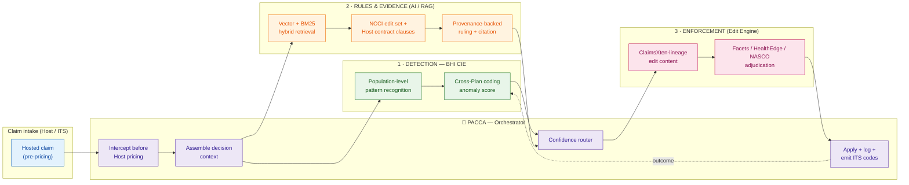
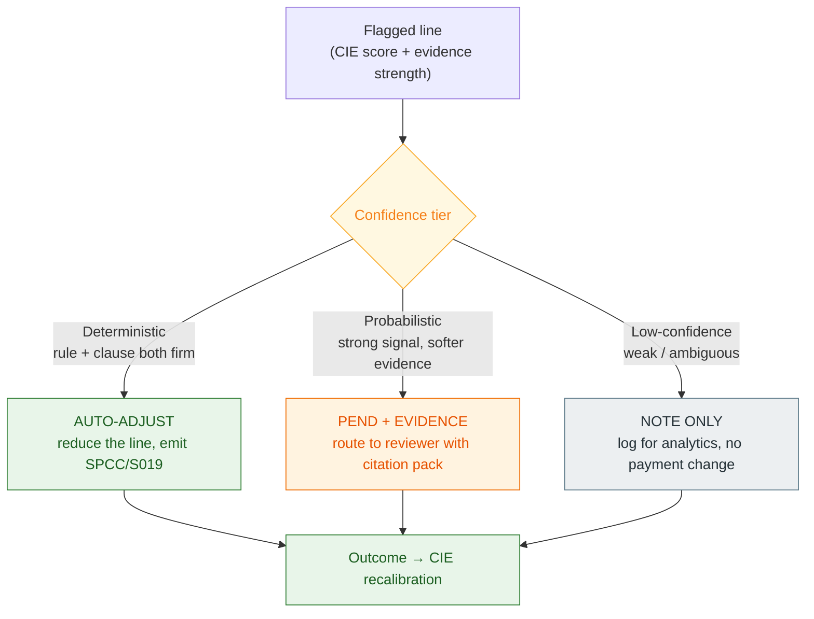
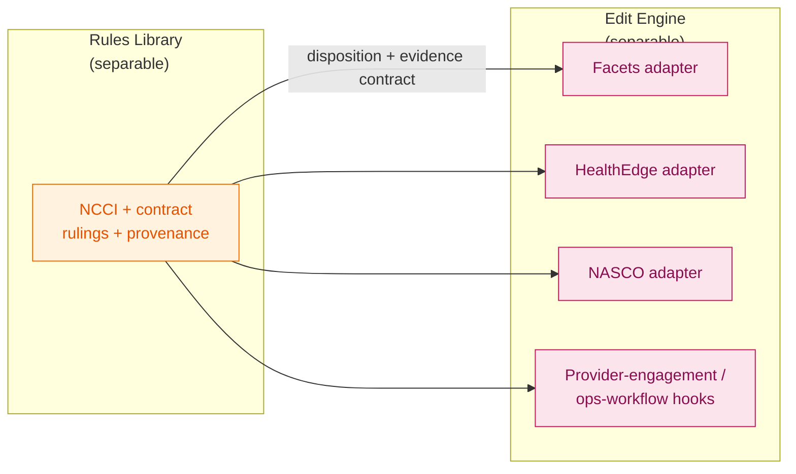
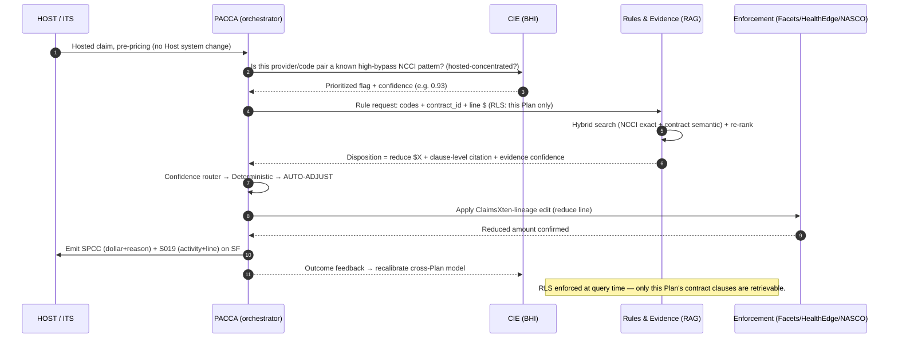

# BCBSA Payment Integrity — Solution Approach & AI-Driven Design

**Upcoding Detection & Coding Integrity Engine — A Proposed Path Forward**
**Prepared by:** Emids (paired with 13point1 Advisors)
**Date:** July 2026
**Companion to:** `BCBSA_PI_Proposal_Approach.pptx`

---

## 1. Executive Summary

The Association has strong **detection** (the Coding Integrity Engine, live at BCBSSC) but a broken
**enforcement** path: a flagged claim does not reliably become a *reduced payment*, and neither
detection nor enforcement travels cleanly across Plans on Blue Card / Inter-Plan (ITS) claims.

This document proposes a **shared, AI-driven pre-pay Payment Integrity (PI) layer** that closes the
**detection-to-enforcement gap**. It sits *in front of Host Plan pricing* on hosted (out-of-area)
claims, routes each flagged line by **confidence tier** to an appropriate disposition, and attaches
**clause-level, provenance-backed evidence** to every action so a reduction is defensible and
auditable.

The design is built on three cooperating layers, all wrapped by an orchestrator (**PACCA**):

| Layer | Capability | AI role | Status (per deck) |
|---|---|---|---|
| **1 — Detection** | BHI **Coding Integrity Engine (CIE)** | Population-level ML pattern recognition across Plans | Live / piloting |
| **2 — Rules & Evidence (Rules Library)** | Contract + policy intelligence layer | **Retrieval-Augmented Generation (RAG)** over contracts, NCCI edits, coding policy | Solutioning |
| **3 — Enforcement (Edit Engine)** | Pre-pay edit execution | ClaimsXten-lineage edit content on Facets / HealthEdge / NASCO | Emids platform depth |

> **Key design promise: no Host Plan system changes.** The layer intercepts the claim *before* Host
> pricing and ITS transmission, so Plans adopt it without re-plumbing adjudication.

> **Modularity is a first-class requirement (per meeting feedback).** The Association is
> deliberately treating the **rules library** and the **edit engine** as *two separable components* —
> it is open to sourcing each from a different provider. This design keeps the layers **decoupled
> behind stable contracts** (see §3.4) so any layer can be adopted, replaced, or procured
> independently. The engine must integrate with existing **Facets, HealthEdge, and NASCO** adjudication
> instances and with the **provider-engagement and operational-team workflows** already in place —
> not merely intake and standardize data.

---

## 2. Problem Analysis (from the proposal)

### 2.1 Two problems the Association is closing

**Coding Integrity Engine (CIE) — the detection-to-action gap**
- The scoring engine identifies upcoding patterns well, but a flag **does not reliably translate
  into a reduced payment**. Detection and enforcement are not connected.
- CIE performs for SC because SC has the **clinical data depth** to support scoring. Other Plans
  lack that depth, so replication is fundamentally a **data-availability + integration** problem.

**Blue Card PI/CI — the cross-Plan value leak**
- Today's editing is **traditional, rules-based, pre-pay, and plan-by-plan**.
- Savings track **provider-relationship ownership**: local-member claims capture more value because
  the servicing Plan holds the contract; **Blue Card claims yield less even when the edit is correct.**
- Future state: a **configurable edit engine** (shared, toggleable edits — not plan-specific logic)
  with an **analytics layer** showing what fires, how often, and with what impact — embedded in
  local Plan claim operations, not a downstream batch add-on.

### 2.2 Why today's mechanism is insufficient

The current ITS mechanism (SPCC¹ / S019 special notation codes, ARC² adjustments) improved
**which** activity gets *reported* between Host and Home Plans. It did **not** deliver:

- cross-Plan **detection**,
- real-time **scoring** at adjudication speed, or
- shared **enforcement**.

*¹ Special Pricing Condition Code (S053/S052 claim; S057/S058 line). ² Adjustment Reason Code.*

### 2.3 Open unknowns we explicitly carry (not gloss over)

1. Can the Rules & Evidence layer meet **real-time adjudication-speed SLAs**?
2. Does the Host Plan have **contract data at SF-creation time** for an already-flagged claim?
3. **Who authorizes auto-adjust** on deterministic flags — the Host Plan, or the shared engine?

These become explicit workstream questions in the 30-60-90 roadmap (§8), each with a spike to
de-risk it.

---

## 3. Target Solution Architecture

### 3.1 The layered stack + orchestrator (PACCA)



### 3.2 Confidence-tiered routing (the core enforcement logic)

Every flagged line is routed by the **joint confidence** of *detection* (CIE) and *evidence*
(Rules & Evidence layer). This is what turns "a flag" into "a defensible action":



| Tier | Condition | Action | Human in loop? |
|---|---|---|---|
| **Deterministic** | NCCI/public edit fires **and** contract clause is explicit | **Auto-adjust** the line; write reduction + evidence | No (post-hoc audit) |
| **Probabilistic** | Strong CIE signal but evidence is contract-conditional | **Pend** with an evidence pack for a reviewer | Yes |
| **Low-confidence** | Weak signal or no supporting clause | **Note only** — analytics, no payment change | Monitored |

### 3.3 How this maps onto the current Host↔Home flow

The layer runs at **step ④ (claim priced; SF created → submission to Home Plan)** on the deck's
current-state diagram. Because it runs before SF creation, its findings ride the **existing ITS
signaling** the Home Plan already trusts:

- **Pre-payment findings** → SF carries **SPCC** (dollar + reason) plus **S019** (specific activity +
  line). *E.g., $340 saved on line 3 → SPCC 028 + S019 "DM003".*
- **Post-payment findings** → travel separately via a claim adjustment carrying an **ARC**.
- Home Plan **verifies eligibility/benefits** and relies on the carried finding rather than
  re-reviewing it — so evidence quality is what earns the reduction.

### 3.4 Decoupled components & platform-agnostic integration (per meeting feedback)

The Association was explicit that the **rules library** and the **edit engine** may be sourced
separately, and that the engine must fit *existing* adjudication platforms and operational workflows —
"it's not just about being able to intake data and standardize it." The architecture is designed for
this from the outset:

- **Stable contracts between layers.** Detection ↔ Rules ↔ Enforcement communicate through
  versioned, documented interfaces (a scored-flag contract and a disposition+evidence contract).
  Any layer can be swapped or supplied by a different vendor without touching the others.
- **Rules library as a standalone asset.** The Rules & Evidence layer (NCCI edits + contract clauses,
  RAG-retrievable with provenance) is usable on its own — a Plan could consume its rulings even if it
  runs a different execution engine.
- **Engine as a platform-agnostic adapter.** The enforcement layer targets **Facets, HealthEdge, and
  NASCO** instances through per-platform adapters, applying ClaimsXten-lineage edit content within
  each system's native adjudication logic.
- **Operational-workflow & provider-engagement integration.** The engine plugs into the operational
  teams' existing case/pend queues and **provider outreach/education** workflows (one of the 7 BCBSA
  PI activities), so a flag surfaces where staff already work rather than in a parallel tool.



> **Why this matters commercially:** it lets the Association adopt the pieces where Emids is strongest
> (edit content + platform depth) without forcing a single-vendor, all-or-nothing decision — matching
> exactly how they said they want to evaluate the two components.

---

## 4. The AI-Driven Solution

Two of the three layers are genuinely AI-driven; the third is deterministic execution. Being precise
about *where* AI adds value (and where it must **not** be a black box) is central to earning trust
with claim operations.

### 4.1 Layer 1 — CIE as population-level anomaly detection

**Problem it solves:** find upcoding patterns *across Plans* that no single Plan's rules would catch,
and prioritize the ones concentrated on **hosted** claims (where value leaks today).

- **Signal:** provider × code-pair × specialty behavior vs. a **peer-cohort baseline** (population
  norm). Upcoding shows up as a provider whose distribution of high-intensity codes, unbundling,
  or modifier usage deviates from clinically similar peers.
- **Method:** unsupervised/semi-supervised anomaly scoring (e.g., peer-relative z-scores, isolation
  forest / gradient-boosted residual models) producing a **bypass-risk score** per
  provider/code-pattern, with **hosted-claim concentration** as a first-class feature.
- **Output:** a prioritized flag — *"provider/code pair is a known high-bypass NCCI pattern,
  concentrated on hosted claims"* — with a calibrated probability, not a binary.
- **Feedback loop:** every disposition (§3.2) feeds back to **recalibrate** CIE, so enforcement
  outcomes sharpen the cross-Plan model over time.

### 4.2 Layer 2 — Rules & Evidence Layer as governed RAG (the differentiator)

This is where AI turns *"we think this is upcoding"* into *"here is the reduced amount and the exact
contract clause + edit rule that authorizes it."* It is a **Retrieval-Augmented Generation** system
over three governed corpora, built on the retrieval design already prototyped in
`vector_layer_design.md`:

**Corpora indexed (chunked, embedded, metadata-tagged):**
1. **Public NCCI edit set** — PTP (Procedure-to-Procedure) pairs, MUEs, modifier-bypass rules.
2. **Host Plan provider contracts** — reimbursement terms, bundling/unbundling clauses, effective
   dates. *(This is unknown #2 — availability at SF-creation time is a workstream.)*
3. **Coding policy / clinical guidelines** — CMS coding intent, specialty society guidance.

**Why RAG and not a fine-tuned generative model:** payment decisions must be **grounded and
citable**. The model never invents a rule; it **retrieves** the governing clause and the applicable
edit, then composes a disposition with a **clause-level citation** attached. Provenance is a
first-class output, not an afterthought.

```mermaid
flowchart LR
    Q["Decision request<br/>provider + code pair +<br/>contract id + line $"] --> EMB["Embed query"]
    EMB --> HS["Hybrid search<br/>dense (HNSW) + BM25 (exact codes)"]
    HS --> RLS["Authz / RLS filter<br/>Plan · contract · effective_date"]
    RLS --> RR["Re-rank + assemble<br/>evidence pack"]
    RR --> RULE["Compose disposition<br/>+ clause-level citation"]
    RULE --> OUT["Reduced amount +<br/>provenance + confidence"]

    classDef a fill:#e3f2fd,stroke:#1565c0,color:#0d47a1;
    classDef b fill:#fff3e0,stroke:#ef6c00,color:#e65100;
    classDef c fill:#e8f5e9,stroke:#2e7d32,color:#1b5e20;
    class Q,EMB a; class HS,RLS,RR b; class RULE,OUT c;
```



**Retrieval design (reused from the PopA vector layer):**

| Decision | Choice | Why it matters here |
|---|---|---|
| **Hybrid retrieval** | Dense (HNSW) **+** BM25 keyword | NCCI codes (`99214`, modifier `59`) must match *exactly*; contract language matches *semantically* |
| **Chunking** | Section-aware, 200–500 tokens + overlap | Preserves contract clause / edit-rule boundaries |
| **Metadata + RLS** | `plan`, `contract_id`, `effective_date`, authz tags | A Host Plan's contract clause is **only** retrievable for that Plan's claim — enforced at query time |
| **Freshness** | Re-embed on CDC; version vectors | New contract year / NCCI quarterly update coexists; the `effective_date` filter picks the right one |
| **Provenance** | Return `chunk_id` + source citation | Every reduction ships with the clause that authorizes it |

### 4.3 Layer 3 — Deterministic enforcement (intentionally *not* AI)

Once the disposition is decided, execution is **deterministic ClaimsXten-lineage edit content** on
**Facets / HealthEdge / NASCO** (via per-platform adapters). AI decides *what and why*; the platform
edit applies *how much*, consistently and auditably. This separation is what makes the outcome
defensible in a payment-operations context.

### 4.4 Trust, safety & governance (non-negotiables)

- **Grounded-only answers** — no clause retrieved ⇒ no auto-adjust (degrades to Note-only).
- **Human-in-the-loop** on the Probabilistic tier; auto-adjust reserved for Deterministic.
- **Full audit trail** — every action stores CIE score, retrieved evidence `chunk_id`s, contract
  citation, and the emitted SPCC/S019 codes.
- **PHI handling** — the enforcement decision uses **coding + contract** data, not clinical PHI; where
  clinical context is needed, RLS + PHI tags gate retrieval (per the vector-layer security model).
- **Explainability** — a reviewer sees the exact NCCI rule + contract clause, never a bare score.

---

## 5. Technical Approach (Detailed)

### 5.1 Reference technology stack

| Concern | Choice | Notes |
|---|---|---|
| Orchestration (**PACCA**) | Stateless service, event-driven | Intercepts pre-pricing; sub-second budget |
| Detection (**CIE**) | Python/PySpark ML; batch baseline + online scoring | Population baselines refreshed on cadence; scores served from a feature/score store |
| Vector store | **pgvector** (co-located with governed relational data); pluggable to Milvus/Qdrant/Azure AI Search | Per `vector_layer_design.md` §5 decision guide |
| Index | **HNSW** (`vector_cosine_ops`), tune `ef_search`; IVF/PQ at memory limits | High recall at low latency |
| Embeddings | Domain model (clinical/coding-aware), versioned | `embed_model_version` tagged on every chunk |
| Enforcement (Edit Engine) | ClaimsXten-lineage edit content on **Facets / HealthEdge / NASCO** (per-platform adapters) | Emids platform depth |
| Signaling | ITS **SPCC / S019** (pre-pay); **ARC** (post-pay) | No Host Plan system changes |
| Analytics layer | Delta / warehouse + dashboards | "What fired, how often, with what impact" |

### 5.2 End-to-end sequence (target architecture)



### 5.3 SLA & latency strategy (addresses unknown #1)

- **Pre-compute** CIE scores at the provider/code-pattern grain so query-time is a **lookup**, not a
  model run.
- **Warm** the vector index (HNSW resident); cap `top-k` and re-rank depth for a fixed latency budget.
- **Tiered timeout:** if evidence retrieval can't complete inside the adjudication budget, **degrade
  gracefully to Pend/Note** rather than block the claim — never hold up payment.

### 5.4 Data availability strategy (addresses unknown #2)

- Establish a **contract-terms ingestion** feed per Host Plan into the governed corpus, keyed by
  `contract_id` + `effective_date`, CDC-refreshed.
- Where contract data is **not** available at SF-creation, the line routes to **Note-only** (analytics)
  or **Pend** — the system is honest about what it can prove.

### 5.5 Authorization model (addresses unknown #3)

- **Deterministic tier auto-adjust** governed by an explicit, per-Plan **toggle** (the "configurable,
  toggleable edits" future state). A Plan opts a given edit into auto-adjust vs. pend.
- Default posture during rollout: **Pend + evidence**, graduating edits to auto-adjust as confidence
  and Plan comfort build (phased rollout, §8).

---

## 6. Worked Example — NCCI PTP Unbundling on a Hosted Claim (end-to-end)

This traces **one hosted claim line** through all three layers with concrete values — the same
NCCI walkthrough as slide 5, made technical.

### 6.1 The claim

An out-of-area BCBS member sees a provider in the **Host** Plan's territory. The provider bills:

| Line | CPT | Description | Modifier | Billed |
|---|---|---|---|---|
| 1 | **93000** | Electrocardiogram, complete (tracing + interpretation + report) | — | $52.00 |
| 2 | **93010** | Electrocardiogram, **interpretation and report only** | — | $28.00 |

**NCCI PTP context:** `93000` is a *complete* ECG; `93010` (interpretation-only) is a **component**
of it. Reporting both on the same day for the same encounter is an **unbundling** pattern — the
Column 2 code (`93010`) is bundled into Column 1 (`93000`) unless a valid modifier justifies it.

### 6.2 Step 1 — PACCA intercepts (no Host system change)

The claim reaches the shared PI/CI service **before** Host pricing and ITS transmission. PACCA
assembles the decision context: `provider_id`, code pair `(93000, 93010)`, `contract_id = HOSTPLAN-4471`,
line dollars, and place-of-service.

### 6.3 Step 2 — CIE returns a prioritized flag

PACCA asks CIE: *is `(93000 → 93010)` a known high-bypass NCCI pattern for this provider,
concentrated on hosted claims?*

```json
{
  "provider_id": "PRV-88213",
  "code_pair": ["93000", "93010"],
  "pattern": "NCCI_PTP_unbundle",
  "peer_cohort": "cardiology_office_POS11",
  "provider_unbundle_rate": 0.71,
  "peer_baseline_rate": 0.06,
  "hosted_claim_concentration": 0.82,
  "cie_confidence": 0.93
}
```

**Read:** this provider unbundles this pair **71%** of the time vs. a **6%** peer norm, and it's
**82% concentrated on hosted claims** — exactly the value-leak profile. CIE confidence **0.93**.

### 6.4 Step 3 — Rules & Evidence Layer (RAG) is queried

PACCA calls the Rules & Evidence layer for the *ruling + evidence*. This is the AI/RAG step.

**Hybrid retrieval** — exact-code match (BM25) for the NCCI rule, semantic match for the contract:

```sql
-- conceptual: retrieve governing NCCI edit + this Plan's contract clause
SELECT chunk_id, text, source, 1 - (embedding <=> :qv) AS score
FROM evidence_chunks
WHERE authz_tags && ARRAY['plan:HOSTPLAN-4471']      -- RLS: this Plan's contract only
  AND effective_date <= DATE '2026-07-01'
  AND (
        doc_type = 'NCCI_PTP'                          -- public edit set
     OR (doc_type = 'CONTRACT' AND contract_id = 'HOSTPLAN-4471')
      )
ORDER BY embedding <=> :qv
LIMIT 20;   -- then fuse with BM25 exact-code hits and re-rank
```

**Top evidence pack returned:**

| chunk_id | source | dense | bm25 | fused | what it says |
|---|---|---|---|---|---|
| `NCCI_PTP_93000_93010` | NCCI PTP table | 0.88 | 0.97 | **0.94** | `93010` is Column 2 to `93000`; **Modifier Indicator = 0** (no modifier can bypass) |
| `HOSTPLAN-4471_reimb_§4.2` | Host contract | 0.91 | 0.72 | **0.83** | "Component codes bundled into a comprehensive code are **not separately reimbursable**." |

**Disposition composed (grounded, cited):**

```json
{
  "decision": "REDUCE_LINE",
  "target_line": 2,
  "reduced_amount": 28.00,
  "reason": "NCCI PTP: 93010 is a component of 93000; MI=0, no modifier bypass permitted.",
  "evidence": [
    {"source": "NCCI PTP", "chunk_id": "NCCI_PTP_93000_93010", "citation": "PTP pair 93000/93010, Modifier Indicator 0"},
    {"source": "Contract HOSTPLAN-4471", "chunk_id": "HOSTPLAN-4471_reimb_§4.2", "citation": "§4.2 Bundling"}
  ],
  "evidence_confidence": 0.95
}
```

### 6.5 Step 4 — Confidence router decides the tier

- CIE confidence **0.93** (strong signal) **AND**
- Evidence: NCCI **MI = 0** (no modifier can justify separate payment) + explicit contract clause
  → evidence confidence **0.95**.

Both the rule and the clause are **firm** ⇒ **Deterministic tier ⇒ AUTO-ADJUST** (and this edit is
toggled to auto-adjust for HOSTPLAN-4471 per the Plan's configuration).

> Contrast: had the NCCI Modifier Indicator been **1** (a modifier *could* justify the pair) and the
> claim carried modifier `59`, evidence confidence would drop and the line would route to
> **Pend + evidence** for a reviewer instead of auto-adjusting.

### 6.6 Step 5 — Enforcement applies the edit

PACCA invokes the **ClaimsXten-lineage edit** on the target platform (Facets/HealthEdge/NASCO via its
adapter), which denies line 2 as bundled.
Payable amount drops from **$80.00 → $52.00** — a **$28.00** pre-pay saving on this claim.

### 6.7 Step 6 — Emit ITS signaling + recalibrate CIE

The finding rides the **existing ITS channel** the Home Plan already trusts — no Host system change:

```text
SF pre-payment findings on this claim:
  SPCC  028   → $28.00 savings, reason: NCCI component bundling
  S019  "CE002" → activity: code editing, line 2
```

The Home Plan verifies eligibility/benefits and relies on the carried finding. The outcome
(**auto-adjust upheld, $28 saved**) feeds back to **recalibrate CIE**, reinforcing the cross-Plan
bypass model for this provider/pattern.

### 6.8 What this example demonstrates

- **Detection → enforcement, closed:** a CIE flag became a **reduced payment**, not just a report.
- **Cross-Plan value capture:** the leak on **hosted** claims was captured at the Host, pre-pay.
- **Defensible AI:** every dollar is backed by a **retrieved NCCI rule + contract clause citation** —
  grounded RAG, not a black-box score.
- **Configurable & non-disruptive:** the edit is toggleable per Plan and runs with **no Host system
  changes**, riding existing ITS SPCC/S019 signaling.

---

## 7. Analytics Layer (the "what's firing" view)

The configurable-edit future state includes an analytics layer answering, per edit / Plan / provider:

- **What fired** (edit, code pair, NCCI/contract basis)
- **How often** (volume, hosted vs. local split)
- **With what impact** ($ saved, auto-adjust vs. pend vs. note mix, override/appeal rate)
- **Model health** (CIE precision by tier, evidence-retrieval hit rate, false-positive feedback)

This doubles as the **calibration signal** for CIE and the **trust dashboard** for claim operations.

---

## 8. Roadmap — 30 / 60 / 90 Days

| Horizon | Focus | Key outcomes |
|---|---|---|
| **0–30 days** | Align scope; confirm the two problem statements; stand up the fractional pod | Agreed target architecture; **spikes** chartered for the 3 unknowns (SLA, contract data, auth) |
| **30–60 days** | Prove the seam on **one NCCI edit family** (e.g., PTP unbundling) for **one Host Plan** | Working detection→evidence→disposition path in **Pend + evidence** mode; evidence-retrieval accuracy measured |
| **60–90 days** | Graduate first edits to **auto-adjust** (toggled); stand up analytics layer | First realized pre-pay savings on hosted claims; "what's firing" dashboard; CIE recalibration loop live |

**Built in from day one (not separate workstreams):**
Enforceability-based edit sequencing • Plan-configurable, non-disruptive access •
Security & compliance • Phased rollout • **Provider-engagement / operational-workflow fit** •
**Platform-agnostic engine adapters (Facets / HealthEdge / NASCO).**

**Cadence:** regular touchpoint with Luke / Candice to align to the Association product roadmap and
continuously refine the fractional pod's backlog.

> **Program context (per meeting):** Payment Integrity is **one of several initiatives** the
> Association is proposing; a broader strategy sits with Candice. The Association intends to gather
> **Plan-level feedback** on this approach, which may lead to an **RFP**. Our immediate next step is a
> follow-up early the following week to hear how the deck was received and the specific feedback, then
> shape scope accordingly — including whether the **rules library** and **edit engine** are pursued
> together or separately.

---

## 9. Why Emids (paired with 13point1 Advisors)

- Payer-domain delivery in **payment integrity and claim adjudication across multiple Blues plans** —
  operators, not generalist consultants.
- Led **edit-content development in the ClaimsXten lineage** now running at **80%+ of BCBS member
  plans** (through McKesson → Change Healthcare → Lyric).
- Hands-on **Facets / HealthEdge / NASCO** platform depth — *what turns a correctly flagged edit into
  realized savings.*
- **Flexible engagement of the two components.** Because the rules library and edit engine are
  decoupled, the Association can adopt either or both from Emids without a single-vendor commitment —
  matching how it wants to evaluate them.
- SME anchor (**Mark Turner**, Content Practice Lead) + dedicated Facets/HealthEdge/NASCO SMEs and
  delivery associates in a **fractional pod** — senior judgment at the decision points without a
  full-time SME rate.

---

## Appendix A — Glossary

| Term | Meaning |
|---|---|
| **CIE** | Coding Integrity Engine — BHI population-level upcoding detection |
| **PACCA** | Orchestrator that intercepts the claim, calls CIE + Rules layer, routes disposition |
| **Rules & Evidence Layer** | RAG system converting NCCI edits + Host contract terms into provenance-backed rulings |
| **NCCI / PTP** | National Correct Coding Initiative / Procedure-to-Procedure edit pairs |
| **Modifier Indicator (MI)** | NCCI flag: `0` = no modifier bypass; `1` = a modifier may allow separate payment |
| **ITS** | Inter-Plan (BlueCard) claim routing between Host and Home Plans |
| **SPCC** | Special Pricing Condition Code (S053/S052 claim; S057/S058 line) — carries $ + reason |
| **S019** | Special Notation Code — carries specific PI activity + line |
| **ARC** | Adjustment Reason Code — carries post-payment findings |
| **Host / Home Plan** | Host = local Plan where care was rendered; Home = member's Plan that adjudicates |
| **RAG** | Retrieval-Augmented Generation — grounds model output in retrieved, cited source content |
| **Facets / HealthEdge / NASCO** | Core claim-adjudication platforms the edit engine must integrate with via per-platform adapters |
| **Rules Library vs. Edit Engine** | The two components the Association may source separately: the rulings/evidence corpus vs. the platform that executes edits |
| **HNSW** | Hierarchical Navigable Small World — vector index for low-latency high-recall search |
| **RLS** | Row-Level Security — query-time authorization so a Plan sees only its own contract clauses |

## Appendix B — Source references

- `BCBSA_PI_Proposal_Approach.pptx` — proposal deck (problem framing, layered stack, NCCI walkthrough).
- `vector_layer_design.md` — retrieval/RAG design reused for the Rules & Evidence layer (hybrid
  search, pgvector/HNSW, metadata RLS, freshness, provenance).
- `Risk_Engine_Knowledge_Base.md` — coding-rule precedents (SEDITS, confidence-factor modeling) that
  inform the deterministic/probabilistic tiering approach.
```
