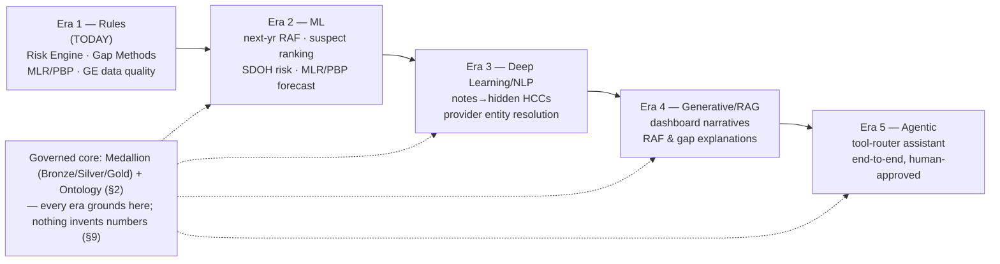
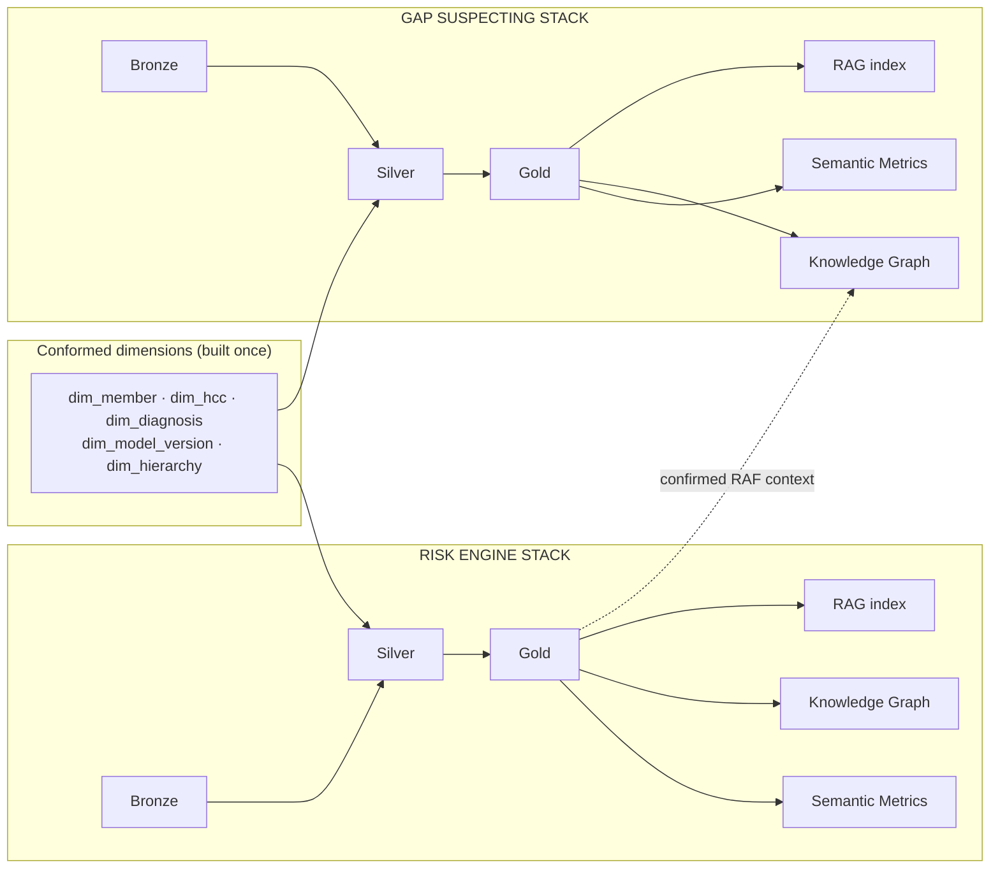
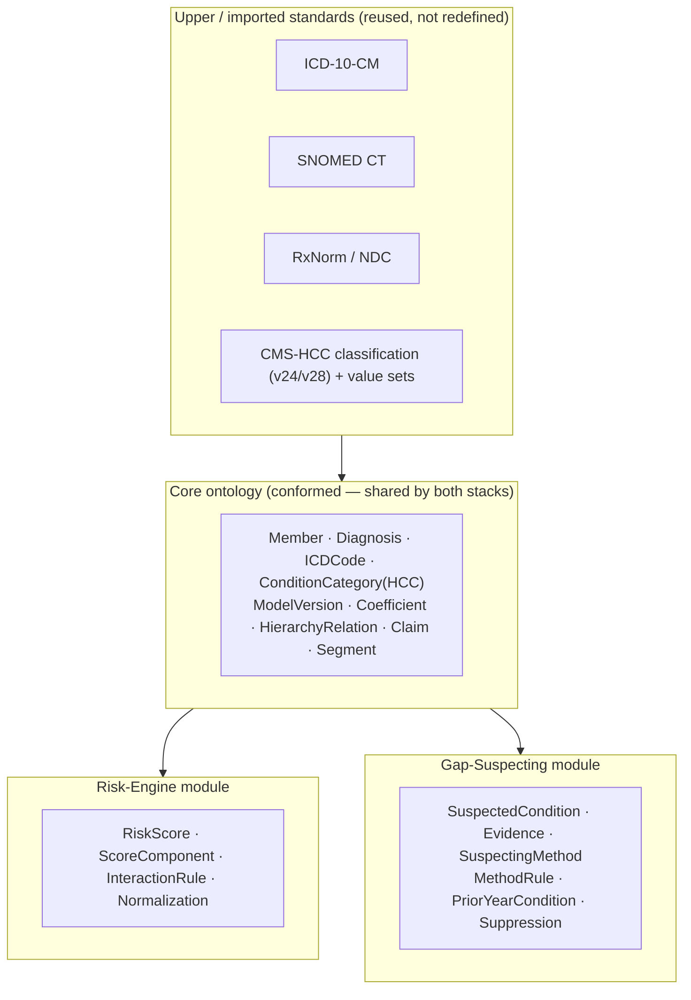
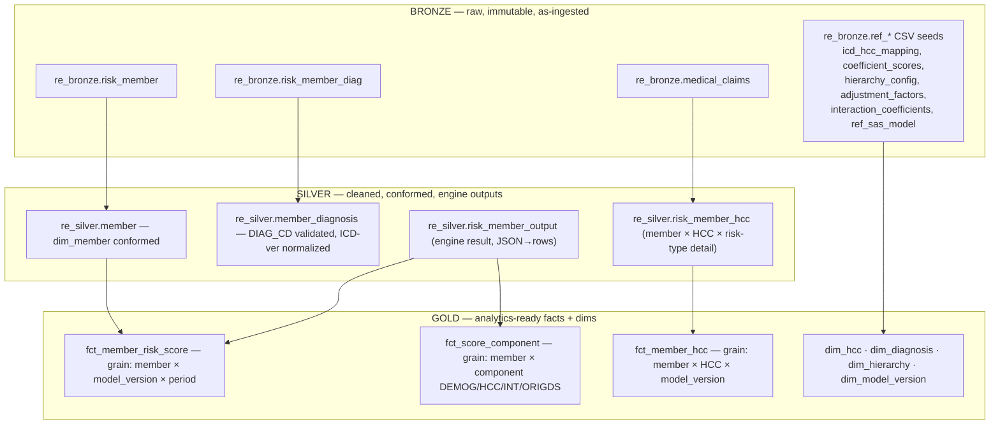
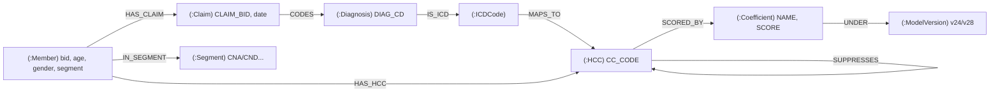
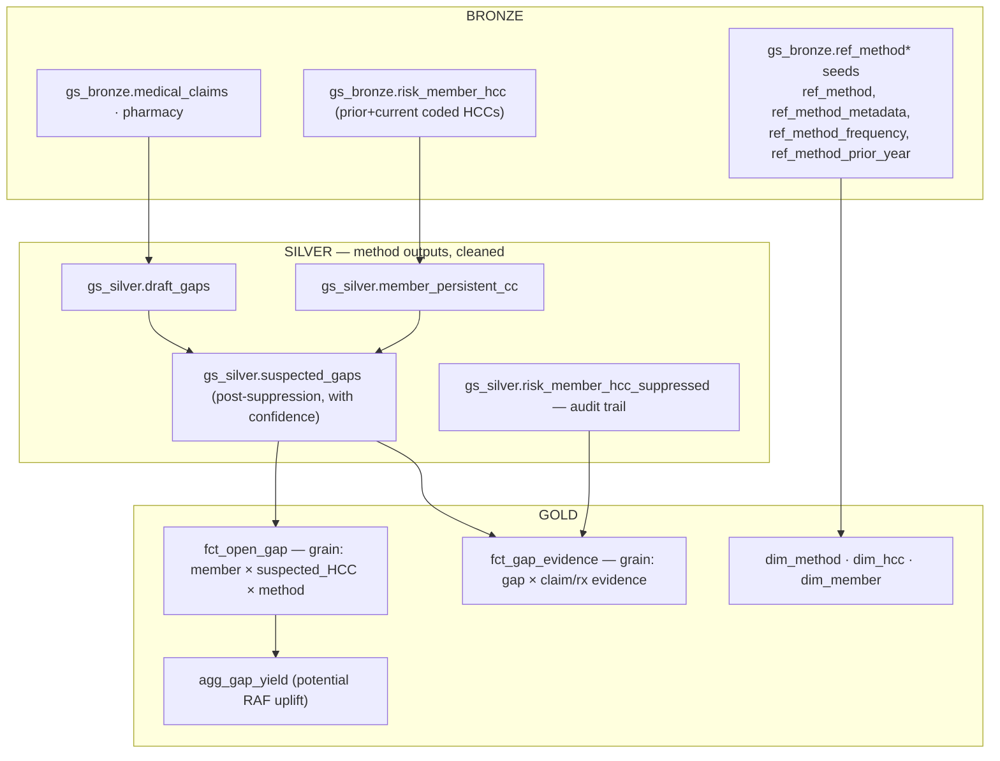
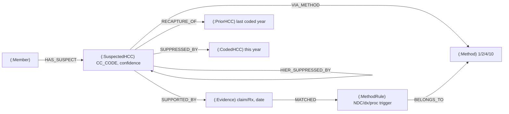
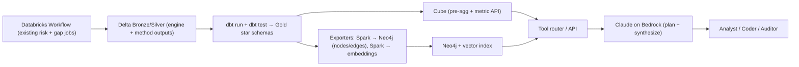
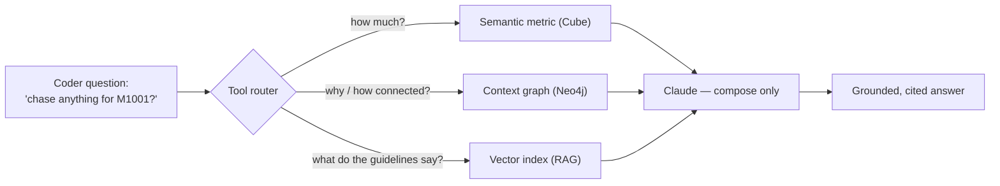

# Medallion + Semantic Metrics + Knowledge Graph + RAG — Two Parallel Stacks

**Author:** Mukesh Kumar (Data Architect)
**Date:** 2026-08-25
**Scope:** Risk Engine and Gap Suspecting, designed as two independent medallion → semantic → KG → RAG pipelines.
**Stack decision:** Best-of-breed external (Neo4j for the KG, dedicated vector store, dbt + Cube for the semantic layer) on top of the existing Databricks / Unity Catalog / Delta lakehouse.

---

## What PopA does — a quick primer

Population Advyzer (PopA) is a Medicare Advantage / CMS risk-adjustment platform. Its core capabilities:

- **Risk Engine** — Calculates each member's CMS risk score (RAF) from their diagnoses. It maps ICD codes to HCCs (condition categories), applies model coefficients, hierarchy suppression, disease interactions, and normalization across model families (HCC v24/v28, RxHCC, ESRD, persistence). Answers: *"what is this member's risk score, and is it defensible?"*

- **Gap Suspecting** — Finds conditions a member *likely has but hasn't been coded* this year, with supporting evidence and a confidence factor. Four suspecting methods:
  - **Method 1 — On Rx, no CC:** member is on a drug that implies a condition, but the relevant condition category isn't coded.
  - **Method 2 — NOS/NEC dx, no CC:** a nonspecific ("not otherwise specified") diagnosis is coded, but the specific relevant condition category isn't.
  - **Method 4 — Prior-Year CC:** a chronic condition coded in a prior year hasn't been recaptured this year (persistence/recapture).
  - **Method 10 — High-Risk Proc/Dx, no CC:** a high-risk procedure or diagnosis is present, but the relevant condition category isn't coded.

- **MLR (Medical Loss Ratio)** — The share of premium spent on medical claims (claims ÷ premium). A core plan-profitability and regulatory metric; PopA computes it at member/plan grain.

- **PBP (Plan Benefit Package)** — The CMS-defined benefit design for a plan. PopA ingests CMS PBP files so risk, cost, and gap metrics can be sliced by plan/benefit package.

- **MA Dashboard** — The analytics layer that surfaces the above to business users: member-level and per-HCC views, provider and health-system rollups, quality metrics, member segments, PCP attribution, MLR and PBP mix — the reporting face of the platform.

### Benefits over the legacy on-prem (SQL Server) system

- **Elastic, parallel compute** — Spark on Databricks scales out for millions of members instead of a fixed on-prem server; heavy jobs finish in a fraction of the time (e.g., segmented data-quality validation went from ~25 hours to ~90 seconds via distributed aggregation).
- **Decoupled storage & compute** — Delta Lake on cloud object storage; pay for compute only when running, no monolithic server to size for peak.
- **ACID + time-travel (Delta Lake)** — Reliable incremental MERGE loads, reproducible reruns, and historical snapshots for audit — hard to get from the legacy processing DBs.
- **Unified governance (Unity Catalog)** — Centralized access control, lineage, and PHI/HIPAA least-privilege across all catalogs (`pop_{env}`), replacing per-database permissions.
- **CI/CD & versioned deployments** — Git-backed bundles deploy dev → qa → stg → prod repeatably, versus manual on-prem script promotion.
- **AI-ready foundation** — The same governed lakehouse feeds the semantic → KG → RAG → agentic layers described below; the on-prem stack had no path to modern AI.
- **Interoperability** — Native export to Snowflake and downstream tools, and multi-cloud reach, instead of a closed on-prem footprint.

---

## AI Evolution — mapped to PopA, aligned to future scope

*(An on-ramp to the architecture below: where PopA sits on the AI curve today, and how the medallion → semantic → ontology → KG → RAG stack in this document is the concrete path forward.)*

### The one-line story

> **PopA started with hand-coded rules (CMS-HCC risk scoring). AI is the natural next layer added *on top of* that trusted, auditable core: first *learning* who is high-risk and which conditions are likely missing (ML), then *reading* clinical text to find conditions that never reached a claim (deep learning), then *explaining* results in plain English (generative AI / RAG), and finally *acting* across the whole stack autonomously (agentic AI) — always grounded on the governed numbers, never invented, and always with a human in the loop for a regulated, RADV-facing setting.**

### Simple, layman definition of AI

> **AI is software that learns patterns from data and uses them to make decisions or predictions — instead of a human writing out every rule by hand.** In PopA terms: teaching the computer to look at millions of members' claims, pharmacy fills, and clinical records and spot what an analyst or coder would — who's high-risk, which HCCs are likely missing, where care gaps or MLR/PBP outliers sit — but faster, consistently, and at population scale.

### The 5 eras of AI — mapped to real PopA modules

| # | Era | What it means (layman) | How it maps to PopA (actual modules) |
|---|-----|------------------------|--------------------------------------|
| 1 | **Rule-based** ("if-then") — *where PopA is today* | A human writes explicit rules; the computer just follows them. No learning. | The deterministic core: **Risk Engine** (`cms/` — HCC v24/v28, RxHCC v05/v08, ESRD v21/v24, persistence) applying ICD→HCC mapping, coefficients, hierarchy suppression, disease interactions, normalization. **Gap Suspecting** (`gp_suspecting/`) firing Methods 1/2/4/10 with `CONFIDENCE_FACTOR`→`COMBINED_CONFIDENCE_FACTOR` and a fixed `.75` threshold. **MA Dashboard** (`ma_dashboard_pipeline/`) — MLR (claims÷premium), PBP ingestion, member/provider/health-system/quality metrics, PCP attribution (5-tier), member segments. **Data quality** via **Great Expectations** rules (`ge_rules.csv`, `ge_*_util.py`). Every output traces to a coded rule. |
| 2 | **Machine Learning (ML)** | Instead of hand-writing rules, the computer *learns* the rules from historical data. | **Risk Engine, forward-looking:** predict *next-year* RAF and cost trajectory from claims history rather than only re-scoring. **Gap Suspecting:** learn a close-likelihood score to *rank* suspects, replacing the flat `.75` threshold. **PBP/MLR:** forecast which plan-benefit-package cohorts will drift high-risk or high-MLR. Enrich risk with **SDOH** signals already on hand (`ref_sdoh_*` income / RUCA / SVI). |
| 3 | **Deep Learning / NLP** | ML with many-layered neural nets that handle messy, unstructured data (text, images) on their own. | **Gap Suspecting, supercharged:** read unstructured **clinical notes, discharge summaries, lab/path reports** to surface conditions that never reached a claim — feeding a stronger `COMBINED_CONFIDENCE_FACTOR`. **Entity resolution:** replace rule-based `health_system_normalizer` / provider remaps with embedding-based matching (NPPES). |
| 4 | **Generative AI / LLMs (textual AI)** | AI that *produces* language — summarizing, explaining, drafting — not just classifying. | **This document's stack.** Turn MA Dashboard tiles (member / provider / MLR / PBP) into plain-English narratives; explain *why a RAF is what it is* (§6) and *why a coder should chase a gap* (§7); auto-draft provider outreach and coding-review packets. Powered by the **semantic → KG → RAG** layers (§2–§4) with **Claude on Bedrock**. |
| 5 | **Agentic AI** (today's frontier) | AI that doesn't just answer — it *takes multi-step actions* toward a goal, using tools. | The **tool-router** assistant (§8): plans retrieval across Cube (numbers) + Neo4j (evidence) + RAG (guidelines) and composes a cited answer. Future: an agent that runs the risk engine, checks gap output, refreshes the dashboard, drafts the MLR/PBP report, and stages the **UC→Snowflake** export (`load_db_uc_to_sf.py`) end-to-end — **human-approved** before anything finalizes. |

### Where PopA sits today, and the path forward

Today virtually all of PopA is **Era 1 (rule-based)** — and that is correct for a RADV-defensible system: the numbers must be traceable. The architecture in this document is how PopA climbs the curve **without giving up that auditability**, because each new AI layer sits on top of the governed medallion + ontology, never replacing it:



### Future-scope alignment — capability → era → this doc's layer → modules

| Future capability | AI era | Architecture layer (this doc) | PopA modules touched |
|---|---|---|---|
| Governed, single-definition metrics (RAF, gap yield, MLR, PBP mix) | 1→2 | **Semantic layer / Cube** (§1, §3.2, §4.2) | Risk Engine, Gap Suspecting, MLR, PBP, member segments |
| Explain "why is this RAF / gap what it is" | 4 | **Ontology → KG → RAG** (§2, §3.3–3.4, §4.3–4.4) | `cms/`, `gp_suspecting/`, coefficient/hierarchy refs |
| Predict next-year RAF & rank suspects by close-likelihood | 2 | **Gold facts feeding ML** (§3.1, §4.1) | Risk Engine, Gap Suspecting, SDOH refs |
| Surface hidden HCCs from clinical text | 3 | New unstructured **Bronze → NLP → Evidence** feed into §4 | Gap Suspecting evidence/confidence |
| Natural-language analytics for actuary / coder / auditor | 4→5 | **Tool router + Claude** (§5, §8) | MA Dashboard, Risk Engine, Gap Suspecting |
| End-to-end autonomous run + report + Snowflake publish | 5 | **Agentic orchestration** over §5 pipeline | Databricks Workflows, `load_db_uc_to_sf.py` |

> **The guardrail that makes this safe (see §9):** in every era the AI *proposes*, the governed data layer *provides the numbers*, and a person *approves*. The LLM never computes a metric — it only plans retrieval and writes prose over grounded results. That is what lets PopA adopt modern AI while staying RADV-defensible.

---

## 0. Why two separate stacks (and what they share)

The risk engine answers *"what is this member's risk score, and is it defensible?"* Gap suspecting answers *"what conditions is this member likely missing, and what's the evidence?"* These are different consumers (actuary/finance vs. coder/clinician), different truth semantics (a **scored fact** vs. a **probabilistic suspicion**), and different audit regimes (RADV score defense vs. suspect-to-close workflow). Fusing them into one gold model forces the suspicion's `CONFIDENCE_FACTOR` uncertainty into the RAF's ledger-grade numbers — a data-governance mistake.

Decision: **two independent medallion → semantic → KG → RAG pipelines**, joined only through **conformed dimensions** (Member, HCC/Condition-Category, Diagnosis, Model-Version, Hierarchy). Those dimensions are built once and referenced by both.



---

## 1. Target technology stack (best-of-breed external)

| Layer | Component | Role | Why this one |
|---|---|---|---|
| Bronze/Silver/Gold | **Delta Lake on Databricks / Unity Catalog** | System of record | Keep the lakehouse; don't move it |
| Transform + tests | **dbt** (dbt-databricks adapter) | Silver→Gold models, tests, lineage, docs | Declarative, versioned, testable; `dbt docs` gives column lineage for free |
| Semantic metrics | **Cube** (Cube Cloud/self-host) | One governed definition of every metric (RAF, gap yield…), served over SQL/REST/GraphQL | LLM tool-callable metrics API + caching; decouples metric logic from BI/app |
| Knowledge graph | **Neo4j** (+ native vector index) | Entities & relationships; multi-hop reasoning; GraphRAG | Mature Cypher; hierarchy traversal is native graph work; built-in vector index enables GraphRAG in one store |
| Vector store | **Neo4j vector index** (primary) *or* **Weaviate/pgvector** (if decoupled) | Embeddings of narrative chunks + entity cards | Co-locating vectors with the graph lets retrieval combine semantic similarity **and** graph context |
| LLM | **Claude (Opus/Sonnet 4.x) via Amazon Bedrock** | RAG synthesis, NL→metric, suspect explanation | Already on AWS/Bedrock; keeps PHI inside the account |
| Orchestration | **Databricks Workflows** (existing) + dbt job | Schedule medallion → dbt → export to Neo4j/vector | Reuse existing bundle-based orchestration |
| Serving | FastAPI / tool router | Routes questions to Cube (numbers) vs. Neo4j (relationships) vs. RAG (narrative) | Prevents the LLM from hallucinating numbers |

**Key architectural rule:** the LLM never computes a metric. Numbers come from **Cube**, relationships/traversals from **Neo4j**, narrative/citations from the **vector store**. The LLM only plans retrieval and writes prose over grounded results.

---

## 2. Domain Ontology — the shared contract

The ontology is the **single conceptual schema** for the whole platform. Everything else is a projection of it:

- the **Knowledge Graph** is the ontology's *instance data* (nodes/edges must conform to its classes and properties);
- **Cube** dimensions & measures are its *measurable projections* (every dimension traces to an ontology class or data property);
- **RAG entity cards** are its *natural-language serialization* (one card per individual of an ontology class).

This is what stops "HCC", "condition category", and "CC_CODE" from drifting into three different meanings across the codebase. Define it once, in OWL/RDF (served from a triple store or as a governed `.ttl` in the repo), and generate the Neo4j label model, the Cube dimension list, and the RAG card templates *from* it.

### 2.1 Ontology layering



The **core** module owns the conformed entities (the same ones that become conformed Gold dimensions). The two **domain modules** import core and add only what is specific to scoring vs. suspecting — mirroring the "two separate stacks, shared dimensions" decision.

### 2.2 Core classes and properties

| Ontology class | Definition (intension) | Backing data | Neo4j label | Cube exposure |
|---|---|---|---|---|
| `Member` | An enrolled beneficiary scored/suspected in a cycle | `re_silver.member` / conformed `dim_member` | `:Member` | dimension `member_bid` |
| `Claim` | A billed medical/pharmacy encounter | `risk_member_diag`, `medical_claims`, `pharmacy` | `:Claim` | (evidence grain) |
| `Diagnosis` | A coded diagnosis instance on a claim | `risk_member_diag.DIAG_CD` | `:Diagnosis` | dimension `diag_cd` |
| `ICDCode` | A terminology code (class in ICD-10-CM) | `icd_hcc_mapping.diagnosiscode` | `:ICDCode` | dimension |
| `ConditionCategory` (HCC) | A CMS condition category; the classification target | `dim_hcc` (`ref_chronic_condition`, `ref_risk_hcc`) | `:HCC` | dimension `cc_code` |
| `ModelVersion` | A CMS model + version (cms_hcc v24/v28, esrd, rxhcc) | `dim_model_version` (`ref_sas_model`) | `:ModelVersion` | dimension `model_version_cd` |
| `Coefficient` | A RAF weight for a scoring key under a version | `coefficient_scores` | `:Coefficient` | (score decomposition) |
| `HierarchyRelation` | Parent-suppresses-child within a version | `hierarchy_config` | `[:SUPPRESSES]` | — |
| `Segment` | Community model segment (CNA/CND/CFA/NE_*) | `community_model_rules` | `:Segment` | dimension |

**Object properties (relations):** `hasClaim`, `codesDiagnosis`, `isICDCode`, `mapsToHCC` (domain `ICDCode`, range `ConditionCategory`, qualified by `ModelVersion`), `scoredBy` (`ConditionCategory → Coefficient`), `underModelVersion`, `suppresses` (`ConditionCategory → ConditionCategory`), `inSegment`.

**Data properties:** `memberAge`, `memberGender`, `orec`, `ccCode`, `ccDescription`, `chronicFlag`, `coefficientScore`, `effectiveDate`/`expirationDate`.

**Key axioms (why an ontology, not just a schema):**
- `mapsToHCC` is **many-to-one and version-qualified** — the same `ICDCode` may map to different HCCs under v24 vs v28. Encoded as a reified/qualified relation (an `n-ary Mapping` individual carrying `underModelVersion`), which is exactly what lets the KG diff versions.
- `suppresses` is **transitive within a version and irreflexive** — enables hierarchy closure reasoning ("did any ancestor knock this out?").
- `ConditionCategory ⊑ (chronic ⊔ acute)` and `chronic` conditions are the only ones eligible for Gap Method 4 (persistence). This axiom is the formal link between the two modules.

### 2.3 Risk-Engine module

Adds the scoring vocabulary on top of core:

- `RiskScore` (individual per `Member × ModelVersion × period`) with data properties `rawScore`, `normalizedScore`, `paymentScore`, `weightedScore`.
- `ScoreComponent` — a reified contribution (`DEMOG | HCC | INTERACTION | ORIGDS | HCC_COUNT_PAYMENT`) linking a `RiskScore` to the `Coefficient`/`ConditionCategory` that produced it. This makes "which HCC contributed how much RAF" a first-class, queryable individual — the RADV-defense artifact.
- `InteractionRule` (`ConditionCategory × ConditionCategory → Coefficient`), `Normalization` (factors from `adjustment_factors`).
- Axiom: `paymentScore = normalizedScore × (1 − codingPatternAdjustment)` documented as a derivation rule (computed in Gold, asserted in the ontology for provenance).

### 2.4 Gap-Suspecting module

Adds the evidence/suspicion vocabulary:

- `SuspectedCondition` — a `ConditionCategory` a `Member` likely has but has not coded this cycle; data properties `gapStatus` (Open/Closed Suspect…), `confidenceFactor`, `frequency`.
- `Evidence` — the triggering fact (`Claim`, NDC fill, procedure, or `PriorYearCondition`), with `evidenceDate`, `matchedCode`.
- `SuspectingMethod` (1/2/4/10) and `MethodRule` (the `ref_method_metadata` trigger); `Evidence matched MethodRule belongsTo SuspectingMethod`.
- `PriorYearCondition` and relation `recaptureOf` (Method 4 persistence).
- `Suppression` (in-gap hierarchy, parent-in-member-CCs, cross-method) — reified so the *reason a suspect was killed* is itself a queryable individual (`risk_member_hcc_suppressed`).
- Axioms: a `SuspectedCondition` must have `≥1 Evidence` (existential restriction — no evidence, no suspect); `confidenceFactor ∈ [0,1]`; a suspect whose `ConditionCategory` is already coded this cycle is `disjointWith` an open gap (the suppression rule, stated formally).

### 2.5 Alignment to external vocabularies

Do **not** re-invent clinical terminology — import and map:

| Local class | External vocabulary | Mapping relation |
|---|---|---|
| `ICDCode` | **ICD-10-CM** | `skos:exactMatch` (code = concept) |
| `Diagnosis`/`ConditionCategory` | **SNOMED CT** (clinical meaning) | `skos:relatedMatch` (for RAG semantic search & clinician-facing prose) |
| pharmacy `Evidence` NDC | **RxNorm / NDC** | `skos:exactMatch` |
| `ConditionCategory` | **CMS-HCC v24/v28** | treated as the *classification target* (value sets per version) |

These alignments are what let RAG answer clinical questions ("members on insulin without a coded diabetes HCC") by expanding through SNOMED/RxNorm, while the numbers still come from the CMS-HCC-coded facts.

### 2.6 A concrete slice (Turtle)

```turtle
@prefix pa:  <https://bhi.com/ontology/popadvyzer#> .
@prefix skos:<http://www.w3.org/2004/02/skos/core#> .

pa:ConditionCategory a owl:Class ;
    rdfs:comment "CMS HCC / condition category; classification target." .

pa:mapsToHCC a owl:ObjectProperty ;
    rdfs:domain pa:ICDCode ; rdfs:range pa:ConditionCategory .

pa:suppresses a owl:ObjectProperty, owl:TransitiveProperty ;
    rdfs:domain pa:ConditionCategory ; rdfs:range pa:ConditionCategory .

pa:SuspectedCondition a owl:Class ;
    rdfs:subClassOf [ a owl:Restriction ;
        owl:onProperty pa:supportedBy ; owl:minCardinality 1 ] .   # no evidence → no suspect

# instance slice (member M1001, model v28)
pa:HCC_18 a pa:ConditionCategory ; pa:ccCode "18" ;
    pa:chronicFlag true ; skos:relatedMatch snomed:44054006 .   # diabetes mellitus
pa:E1122 a pa:ICDCode ; skos:exactMatch icd10:E11.22 ;
    pa:mapsToHCC pa:HCC_18 .                                     # qualified by ModelVersion v28
```

### 2.7 How the ontology drives the three layers

- **KG generation:** the Spark→Neo4j exporter emits nodes/edges *only* for ontology-declared classes/relations; a load that references an undeclared label fails CI. The ontology *is* the graph schema (enforced with Neo4j constraints or SHACL shapes).
- **Semantic layer:** every Cube dimension/measure carries a `meta.ontology_ref` back to a class or data property; a metric with no ontology anchor is rejected in review.
- **RAG:** entity cards are generated per ontology class from a template, so a new class automatically produces a new card type — the retrieval corpus stays in lockstep with the model.
- **Versioning:** the ontology is versioned alongside `RISK_MODEL_VERSION`. v24→v28 changes to `mapsToHCC`/`Coefficient` are ontology diffs, which is what makes the "why did RAF change" question answerable at the schema level, not just the data level.

---

## 3. STACK A — Risk Engine

### 3.1 Medallion mapping (to real tables)



- **Bronze** = ingestion + reference CSVs, untouched, with load audit columns. One-to-one with what the pipeline reads today (`risk_member`, `risk_member_diag`, `medical_claims`, the `ma_reference` seeds).
- **Silver** = deduped, typed, conformed. The engine output belongs in Silver, not Bronze — `risk_member_output` and `risk_member_hcc` are *derived* facts. Explode `DIAG_CD_TO_HCC_JSON_LIST` and `HCC_TO_SCORE_JSON_LIST` into rows here so downstream never parses JSON.
- **Gold** = star schema. `fct_member_risk_score` (one row per member × `RISK_MODEL_VERSION` × `YEAR_MONTH`, carrying `RISK_SCORE_RAW/NORMALIZED/PAYMENT/WEIGHTED`), `fct_member_hcc`, and a decomposition fact `fct_score_component` that makes "which HCC contributed how much RAF" a first-class row. Conformed dims `dim_hcc`, `dim_diagnosis` (from `icd_hcc_mapping`), `dim_hierarchy` (from `hierarchy_config`), `dim_model_version` (from `ref_sas_model`).

### 3.2 Semantic metrics (Cube)

Define metrics **once** over the Gold star (illustrative):

```yaml
cubes:
  - name: member_risk
    sql_table: pop_prod.re_gold.fct_member_risk_score
    joins:
      - name: model_version
        sql: "{CUBE}.RISK_MODEL_VERSION = {model_version}.RISK_MODEL_VERSION"
        relationship: many_to_one
    dimensions:
      - name: model_version_cd   # v24 / v28
        sql: RISK_MODEL_VERSION
        type: string
      - name: contract_id
        sql: CONTRACT_ID
        type: string
    measures:
      - name: avg_raf
        sql: RISK_SCORE_PAYMENT_HCC
        type: avg
      - name: member_count
        type: count_distinct
        sql: RISK_MEMBER_ID
      - name: total_raf
        sql: RISK_SCORE_PAYMENT_HCC
        type: sum
      - name: raf_v28_vs_v24_delta   # derived cross-version metric
        type: number
        sql: "{avg_raf_v28} - {avg_raf_v24}"
```

These become the **governed vocabulary**: "average payment RAF", "RAF by contract", "v28 vs v24 delta" have exactly one definition. Every BI dashboard, every API caller, and the LLM hit the same measures — no metric drift.

### 3.3 Knowledge graph (Neo4j)

Model the scoring *causality* — the thing SQL is bad at and RADV auditors care about: **why is this score what it is.**



- `(:HCC)-[:SUPPRESSES]->(:HCC)` encodes `hierarchy_config` — "which HCCs did the hierarchy knock out for this member" is a one-hop query, not a JSON parse.
- `[:MAPS_TO]` and `[:SCORED_BY]` are **versioned** (property `model_version`) so v24 and v28 coexist on the same graph and can be diffed.
- This graph makes RAF **explainable**: a full RAF-contribution path is `Member → Claim → Diagnosis → HCC → Coefficient → ModelVersion`.

### 3.4 RAG

Index **narrative + entity cards** (never raw PHI-heavy claim rows) in the vector store:
- CMS model methodology docs, `Risk_Engine_Knowledge_Base.md`, model-version release notes, coefficient change logs.
- Auto-generated **entity cards**: one short text card per HCC ("HCC 18 = Diabetes with Chronic Complications; v28 coefficient in CNA segment = 0.302; suppresses HCC 19…").

Retrieval is **GraphRAG**: vector search finds relevant HCC/coefficient cards → matched entities anchor a Neo4j traversal → structured facts + citations go to Claude for synthesis. Numbers come from Cube, not the model.

---

## 4. STACK B — Gap Suspecting

### 4.1 Medallion mapping



- **Bronze**: claims, pharmacy, the prior/current `risk_member_hcc`, and the method reference seeds.
- **Silver**: the pipeline's real outputs — `draft_gaps`, `member_persistent_cc`, and `suspected_gaps` after the three suppression layers. Keep `risk_member_hcc_suppressed` as the **evidence/audit** table (why a suspect was *killed* matters as much as why it lives).
- **Gold**: `fct_open_gap` (member × suspected HCC × `METHOD_ID`, with `GAP_STATUS`, `CONFIDENCE_FACTOR`, `FREQUENCY`), `fct_gap_evidence` (the triggering claim/Rx/NDC/procedure — `CLAIM_BID`, `DIAG_CD`, `CLAIM_CD_TYPE`, `MATCHED_CODE`), and `agg_gap_yield` that **joins the risk engine's coefficient dim** to express each open gap as *potential RAF uplift* (the only place the two stacks touch on the data plane, and only via the conformed `dim_hcc`/coefficient).

### 4.2 Semantic metrics (Cube)

```yaml
cubes:
  - name: open_gaps
    sql_table: pop_prod.gs_gold.fct_open_gap
    dimensions:
      - name: method_id      # 1,2,4,10
        sql: METHOD_ID
        type: string
      - name: gap_status     # Open Suspect / Closed Suspect ...
        sql: GAP_STATUS
        type: string
      - name: confidence_band  # derived: High/Med/Low from CONFIDENCE_FACTOR
        sql: "CASE WHEN CONFIDENCE_FACTOR >= 0.75 THEN 'High'
                   WHEN CONFIDENCE_FACTOR >= 0.5 THEN 'Med' ELSE 'Low' END"
        type: string
    measures:
      - name: open_gap_count
        type: count
        filters: [{ sql: "{CUBE}.GAP_STATUS = 'Open Suspect'" }]
      - name: avg_confidence
        sql: CONFIDENCE_FACTOR
        type: avg
      - name: potential_raf_uplift    # gap → coefficient join upstream in Gold
        sql: POTENTIAL_RAF
        type: sum
```

Governed metrics: *open suspect count*, *high-confidence gap rate*, *potential RAF uplift*, *suspect-to-close rate*, *method contribution*. Same single-definition discipline as Stack A.

### 4.3 Knowledge graph (Neo4j — separate database/label space)

The gap graph is **evidence-centric**, not coefficient-centric:



Makes a suspect **defensible in one traversal**: `SuspectedHCC → Evidence → MethodRule` ("suspected because of NDC X on claim Y matching Method 1 rule Z"), plus `RECAPTURE_OF` for Method-4 persistence and the two `SUPPRESSED_BY` edges that explain why *other* candidates were dropped. Coders live in exactly this "why should I chase this?" view.

### 4.4 RAG

- Index: coding guidelines, method definitions (`ref_method` descriptions), condition-specific documentation-requirement docs, `Gap_Suspecting_Requirements_Specification.md`, and per-suspect **evidence cards**.
- GraphRAG answer to a coder: "Member has an **open, high-confidence suspect for HCC 18** (diabetes w/ complications). Evidence: metformin NDC on 2026-03-11 claim (Method 1) + prior-year HCC 18 coded in 2025 (Method 4). Not yet coded in 2026. Documentation needed: …" — every clause traceable to a graph edge or an indexed doc.

---

## 5. End-to-end pipeline (how it runs)



Two dbt projects (`re_gold`, `gs_gold`) so the stacks version and deploy independently. Two Neo4j databases (or label namespaces) for the same reason. Exports run incrementally keyed by `CYCLE_RUN`/`YEAR_MONTH`.

---

## 6. Worked example — Stack A (Risk Engine)

**Member** `M1001`, age 72, segment CNA, model **v28**, period 2026-01.

| Layer | What holds M1001 |
|---|---|
| Bronze | `risk_member` row (DOB, gender, OREC); `risk_member_diag` rows incl. `DIAG_CD=E1122` (diabetes w/ complication) and `I5023` (CHF) |
| Silver | `member_diagnosis`: E1122, I5023 validated; `risk_member_hcc`: HCC 18, HCC 226 assigned; hierarchy already applied |
| Gold | `fct_member_risk_score`: `RISK_SCORE_PAYMENT_HCC = 1.284`; `fct_score_component`: DEMOG 0.395, HCC18 0.302, HCC226 0.331, INTERACTION(DIABETES×CHF) 0.256 |

**Semantic metric (Cube):** analyst asks Cube for `member_risk.avg_raf` filtered `model_version_cd='v28'`, grouped by contract → one governed number, same as the dashboard.

**Knowledge graph (Neo4j):** the RAF explanation is one query:

```cypher
MATCH p = (m:Member {bid:'M1001'})-[:HAS_CLAIM]->(:Claim)-[:CODES]->
          (:Diagnosis)-[:IS_ICD]->(:ICDCode)-[:MAPS_TO]->
          (h:HCC)-[:SCORED_BY]->(c:Coefficient)-[:UNDER]->(:ModelVersion {cd:'v28'})
RETURN h.cc_code, c.name, c.score ORDER BY c.score DESC;
```

Returns the exact HCC→coefficient contributions — the audit-defense artifact.

**RAG (question):** *"Why is M1001's RAF higher under v28 than v24?"* → router: (1) Cube returns `raf_v28_vs_v24_delta = +0.18`; (2) Neo4j diffs `[:SCORED_BY {model_version}]` edges → the diabetes×CHF interaction is weighted higher in v28; (3) vector store returns the v28 methodology note; (4) Claude writes: *"+0.18 RAF, driven mainly by the diabetes–CHF disease interaction, which v28 scores at 0.256 vs 0.19 in v24 [cite]."* Numbers from Cube/Neo4j, prose from Claude.

---

## 7. Worked example — Stack B (Gap Suspecting)

**Member** `M1001`, risk year 2026.

| Layer | What holds the gap |
|---|---|
| Bronze | `pharmacy`: metformin NDC on 2026-03-11; `risk_member_hcc` prior year: HCC 18 coded in 2025; 2026 medical claims show **no** E11.xx |
| Silver | `draft_gaps`: Method 1 (Rx→no CC) + Method 4 (prior-year CC) both fire for HCC 18; suppression layers pass; `suspected_gaps`: HCC 18, `GAP_STATUS='Open Suspect'`, `CONFIDENCE_FACTOR=0.82` |
| Gold | `fct_open_gap`: M1001 × HCC18 × method{1,4}, confidence 0.82; `fct_gap_evidence`: the NDC claim + prior-year coded row; `agg_gap_yield`: potential RAF uplift 0.302 (from conformed coefficient dim) |

**Semantic metric (Cube):** `open_gaps.open_gap_count` and `potential_raf_uplift` by `confidence_band` → "34 high-confidence open gaps, 9.1 potential RAF" — governed, matches the ops dashboard.

**Knowledge graph (Neo4j, gap DB):**

```cypher
MATCH (m:Member {bid:'M1001'})-[:HAS_SUSPECT]->(s:SuspectedHCC {cc_code:'18'})
OPTIONAL MATCH (s)-[:SUPPORTED_BY]->(e:Evidence)-[:MATCHED]->(r:MethodRule)
OPTIONAL MATCH (s)-[:RECAPTURE_OF]->(py:PriorHCC)
RETURN s.confidence, collect(DISTINCT e.detail), collect(DISTINCT r.method), py.last_year;
```

Returns the full defensible chain in one hop-set.

**RAG (question):** *"Which open gaps should I chase for M1001 and why?"* → Cube gives the count/uplift, Neo4j gives the evidence chain, vector store returns the documentation-requirement guideline for diabetes-with-complications → Claude: *"1 high-confidence open gap: HCC 18 (0.82). Supported by metformin fill 2026-03-11 (Method 1) and 2025 HCC-18 coding (Method 4, recapture); no 2026 E11 diagnosis on file. Potential RAF +0.302. Documentation needed: … [cite guideline]."*

---

## 8. Consumer example (interview-ready)

**Scenario:** a coder opens member `M1001` in the review app and asks one plain-English question:
> *"Should I chase anything for this member, and how big is the opportunity?"*

The app fans that one question out to the three stores — **each answers a different *type* of question** — and the LLM only composes the pieces. It never does arithmetic and never invents a fact.



**What each store is asked, and what it returns:**

| Store | Question it answers | Consumer call (simplified) | Returns |
|---|---|---|---|
| **Semantic metric (Cube)** | *How much?* (governed numbers) | `GET /cube/load?measures=open_gaps.open_gap_count,open_gaps.potential_raf_uplift&filters=member_bid=M1001` | `open_gaps=1`, `potential_raf_uplift=0.302`, `avg_confidence=0.82` |
| **Context graph (Neo4j)** | *Why / how is it connected?* (evidence chain) | Cypher: `MATCH (m:Member{bid:'M1001'})-[:HAS_SUSPECT]->(s)-[:SUPPORTED_BY]->(e)-[:MATCHED]->(r) RETURN s,e,r` | Suspect `HCC 18` ← metformin NDC 2026-03-11 (Method 1) + prior-year HCC 18 (Method 4, recapture) |
| **Vector index (RAG)** | *What does the guideline say?* (narrative) | `search("documentation requirements diabetes with chronic complications", top_k=3)` | 3 guideline chunks + citations on required chart elements |

**Consumer pseudo-code (what the app actually runs):**

```python
# 1. NUMBERS — from the semantic layer (never computed by the LLM)
metrics = cube.load(
    measures=["open_gaps.open_gap_count", "open_gaps.potential_raf_uplift"],
    filters=[{"member": "M1001"}])

# 2. RELATIONSHIPS — from the context graph (the "why")
evidence = neo4j.run("""
    MATCH (m:Member {bid:$id})-[:HAS_SUSPECT]->(s:SuspectedHCC)
    OPTIONAL MATCH (s)-[:SUPPORTED_BY]->(e:Evidence)-[:MATCHED]->(r:MethodRule)
    RETURN s.cc_code, s.confidence, collect({detail:e.detail, method:r.method})
""", id="M1001")

# 3. NARRATIVE — from the vector index (the supporting guidance)
docs = vector.search("documentation requirements: diabetes with chronic complications", top_k=3)

# 4. COMPOSE — the LLM only stitches grounded facts into prose
answer = claude.generate(prompt=build_prompt(metrics, evidence, docs))
```

**The composed answer the coder sees:**
> "**Yes — 1 open, high-confidence gap: HCC 18** (diabetes with chronic complications), confidence 0.82, **potential RAF +0.302**. Suspected because a metformin fill on 2026-03-11 (Method 1) and a 2025 HCC-18 coding (Method 4, recapture) exist, but no 2026 diabetes diagnosis is on file. To close it, the chart needs: *[documentation requirements, cited from guideline]*."

**The one-line interview takeaway:**
> *The semantic layer answers **how much**, the context graph answers **why / how things connect**, and the vector index answers **what the knowledge says** — the LLM is only the composer. Numbers come from the metric store, facts from the graph, language from the documents. That separation is what makes the answer both trustworthy and explainable.*

---

## 9. Governance guardrails (non-negotiable for this data)

- **No PHI in the vector store.** Index methodology/guidelines/entity-cards only; keep member-level facts in Delta/Neo4j behind Unity Catalog + Neo4j RBAC, retrieved by ID at query time.
- **LLM never invents numbers.** Router pattern: metrics→Cube, relationships→Neo4j, prose→Claude. The single most important design decision for a RADV-facing system.
- **Version everything.** `model_version` on graph edges and Cube dimensions; a suspect and a score always carry `RISK_MODEL_VERSION` + `CYCLE_RUN`.
- **Keep the suspicion/score boundary.** Gap `CONFIDENCE_FACTOR` never mutates a RAF; the only bridge is `agg_gap_yield`, clearly labeled *potential*.

---

## 10. Open decision & next steps

**Open decision — primary end goal** (changes serving-layer priorities, not the architecture above):
NL analytics · clinical decision support · audit/lineage · data-product API.

**Candidate next steps:**
1. Detail one stack deeper — full dbt Gold models + Cube schema (risk engine), or the full Neo4j export job (Spark → Cypher batch load).
2. Full end-to-end single-member trace across every layer.
3. Sizing/cost + deployment topology (Neo4j, Cube, Bedrock) for STG → PROD.
