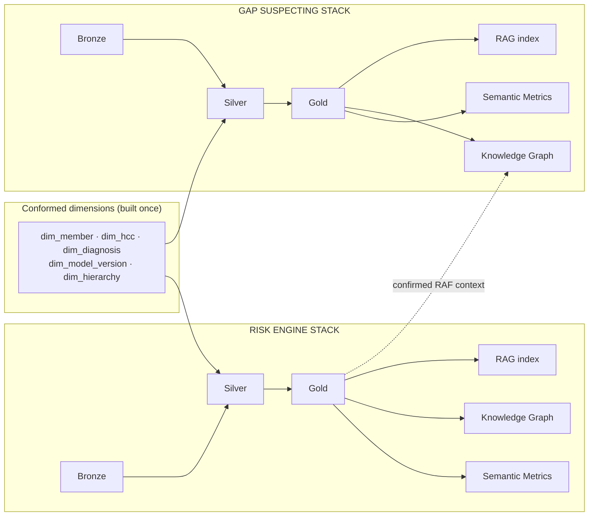
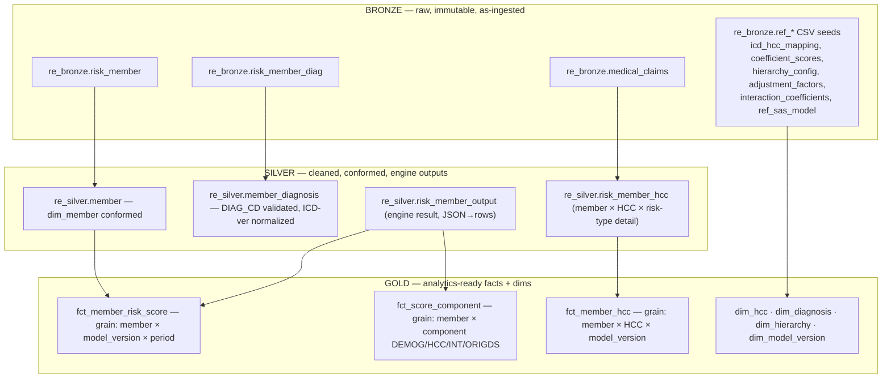
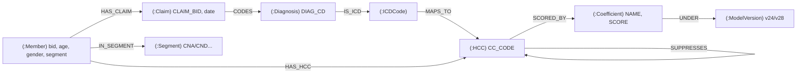
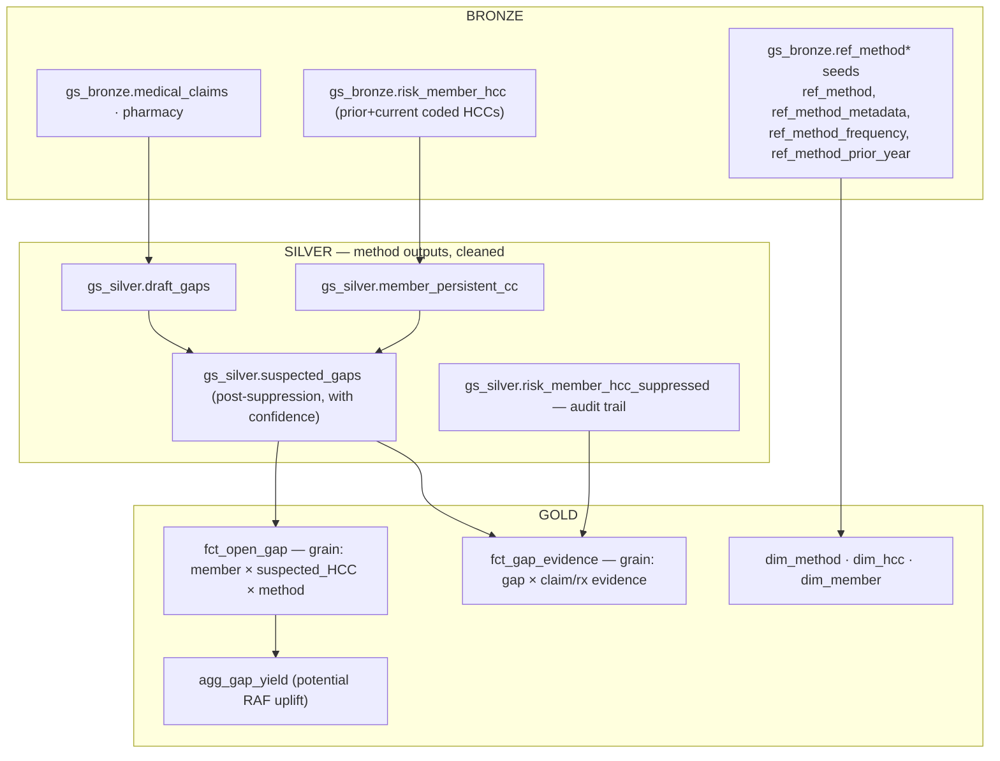
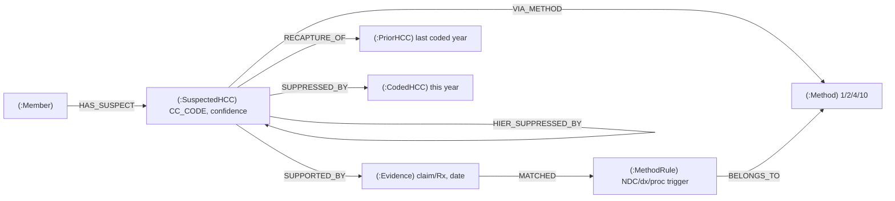
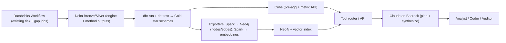

# Medallion + Semantic Metrics + Knowledge Graph + RAG — Two Parallel Stacks

**Author:** Mukesh Kumar (Data Architect)
**Date:** 2026-08-25
**Scope:** Risk Engine and Gap Suspecting, designed as two independent medallion → semantic → KG → RAG pipelines.
**Stack decision:** Best-of-breed external (Neo4j for the KG, dedicated vector store, dbt + Cube for the semantic layer) on top of the existing Databricks / Unity Catalog / Delta lakehouse.

---

## 0. Why two separate stacks (and what they share)

The risk engine answers *"what is this member's risk score, and is it defensible?"* Gap suspecting answers *"what conditions is this member likely missing, and what's the evidence?"* These are different consumers (actuary/finance vs. coder/clinician), different truth semantics (a **scored fact** vs. a **probabilistic suspicion**), and different audit regimes (RADV score defense vs. suspect-to-close workflow). Fusing them into one gold model forces the suspicion's `CONFIDENCE_FACTOR` uncertainty into the RAF's ledger-grade numbers — a data-governance mistake.

Decision: **two independent medallion → semantic → KG → RAG pipelines**, joined only through **conformed dimensions** (Member, HCC/Condition-Category, Diagnosis, Model-Version, Hierarchy). Those dimensions are built once and referenced by both.



---

## 1. Target technology stack (best-of-breed external)

| Layer | Component | Role | Why this one |
|---|---|---|---|
| Bronze/Silver/Gold | **Delta Lake on Databricks / Unity Catalog** | System of record | Keep the lakehouse; don't move it |
| Transform + tests | **dbt** (dbt-databricks adapter) | Silver→Gold models, tests, lineage, docs | Declarative, versioned, testable; `dbt docs` gives column lineage for free |
| Semantic metrics | **Cube** (Cube Cloud/self-host) | One governed definition of every metric (RAF, gap yield…), served over SQL/REST/GraphQL | LLM tool-callable metrics API + caching; decouples metric logic from BI/app |
| Knowledge graph | **Neo4j** (+ native vector index) | Entities & relationships; multi-hop reasoning; GraphRAG | Mature Cypher; hierarchy traversal is native graph work; built-in vector index enables GraphRAG in one store |
| Vector store | **Neo4j vector index** (primary) *or* **Weaviate/pgvector** (if decoupled) | Embeddings of narrative chunks + entity cards | Co-locating vectors with the graph lets retrieval combine semantic similarity **and** graph context |
| LLM | **Claude (Opus/Sonnet 4.x) via Amazon Bedrock** | RAG synthesis, NL→metric, suspect explanation | Already on AWS/Bedrock; keeps PHI inside the account |
| Orchestration | **Databricks Workflows** (existing) + dbt job | Schedule medallion → dbt → export to Neo4j/vector | Reuse existing bundle-based orchestration |
| Serving | FastAPI / tool router | Routes questions to Cube (numbers) vs. Neo4j (relationships) vs. RAG (narrative) | Prevents the LLM from hallucinating numbers |

**Key architectural rule:** the LLM never computes a metric. Numbers come from **Cube**, relationships/traversals from **Neo4j**, narrative/citations from the **vector store**. The LLM only plans retrieval and writes prose over grounded results.

---

## 2. STACK A — Risk Engine

### 2.1 Medallion mapping (to real tables)



- **Bronze** = ingestion + reference CSVs, untouched, with load audit columns. One-to-one with what the pipeline reads today (`risk_member`, `risk_member_diag`, `medical_claims`, the `ma_reference` seeds).
- **Silver** = deduped, typed, conformed. The engine output belongs in Silver, not Bronze — `risk_member_output` and `risk_member_hcc` are *derived* facts. Explode `DIAG_CD_TO_HCC_JSON_LIST` and `HCC_TO_SCORE_JSON_LIST` into rows here so downstream never parses JSON.
- **Gold** = star schema. `fct_member_risk_score` (one row per member × `RISK_MODEL_VERSION` × `YEAR_MONTH`, carrying `RISK_SCORE_RAW/NORMALIZED/PAYMENT/WEIGHTED`), `fct_member_hcc`, and a decomposition fact `fct_score_component` that makes "which HCC contributed how much RAF" a first-class row. Conformed dims `dim_hcc`, `dim_diagnosis` (from `icd_hcc_mapping`), `dim_hierarchy` (from `hierarchy_config`), `dim_model_version` (from `ref_sas_model`).

### 2.2 Semantic metrics (Cube)

Define metrics **once** over the Gold star (illustrative):

```yaml
cubes:
  - name: member_risk
    sql_table: pop_prod.re_gold.fct_member_risk_score
    joins:
      - name: model_version
        sql: "{CUBE}.RISK_MODEL_VERSION = {model_version}.RISK_MODEL_VERSION"
        relationship: many_to_one
    dimensions:
      - name: model_version_cd   # v24 / v28
        sql: RISK_MODEL_VERSION
        type: string
      - name: contract_id
        sql: CONTRACT_ID
        type: string
    measures:
      - name: avg_raf
        sql: RISK_SCORE_PAYMENT_HCC
        type: avg
      - name: member_count
        type: count_distinct
        sql: RISK_MEMBER_ID
      - name: total_raf
        sql: RISK_SCORE_PAYMENT_HCC
        type: sum
      - name: raf_v28_vs_v24_delta   # derived cross-version metric
        type: number
        sql: "{avg_raf_v28} - {avg_raf_v24}"
```

These become the **governed vocabulary**: "average payment RAF", "RAF by contract", "v28 vs v24 delta" have exactly one definition. Every BI dashboard, every API caller, and the LLM hit the same measures — no metric drift.

### 2.3 Knowledge graph (Neo4j)

Model the scoring *causality* — the thing SQL is bad at and RADV auditors care about: **why is this score what it is.**



- `(:HCC)-[:SUPPRESSES]->(:HCC)` encodes `hierarchy_config` — "which HCCs did the hierarchy knock out for this member" is a one-hop query, not a JSON parse.
- `[:MAPS_TO]` and `[:SCORED_BY]` are **versioned** (property `model_version`) so v24 and v28 coexist on the same graph and can be diffed.
- This graph makes RAF **explainable**: a full RAF-contribution path is `Member → Claim → Diagnosis → HCC → Coefficient → ModelVersion`.

### 2.4 RAG

Index **narrative + entity cards** (never raw PHI-heavy claim rows) in the vector store:
- CMS model methodology docs, `Risk_Engine_Knowledge_Base.md`, model-version release notes, coefficient change logs.
- Auto-generated **entity cards**: one short text card per HCC ("HCC 18 = Diabetes with Chronic Complications; v28 coefficient in CNA segment = 0.302; suppresses HCC 19…").

Retrieval is **GraphRAG**: vector search finds relevant HCC/coefficient cards → matched entities anchor a Neo4j traversal → structured facts + citations go to Claude for synthesis. Numbers come from Cube, not the model.

---

## 3. STACK B — Gap Suspecting

### 3.1 Medallion mapping



- **Bronze**: claims, pharmacy, the prior/current `risk_member_hcc`, and the method reference seeds.
- **Silver**: the pipeline's real outputs — `draft_gaps`, `member_persistent_cc`, and `suspected_gaps` after the three suppression layers. Keep `risk_member_hcc_suppressed` as the **evidence/audit** table (why a suspect was *killed* matters as much as why it lives).
- **Gold**: `fct_open_gap` (member × suspected HCC × `METHOD_ID`, with `GAP_STATUS`, `CONFIDENCE_FACTOR`, `FREQUENCY`), `fct_gap_evidence` (the triggering claim/Rx/NDC/procedure — `CLAIM_BID`, `DIAG_CD`, `CLAIM_CD_TYPE`, `MATCHED_CODE`), and `agg_gap_yield` that **joins the risk engine's coefficient dim** to express each open gap as *potential RAF uplift* (the only place the two stacks touch on the data plane, and only via the conformed `dim_hcc`/coefficient).

### 3.2 Semantic metrics (Cube)

```yaml
cubes:
  - name: open_gaps
    sql_table: pop_prod.gs_gold.fct_open_gap
    dimensions:
      - name: method_id      # 1,2,4,10
        sql: METHOD_ID
        type: string
      - name: gap_status     # Open Suspect / Closed Suspect ...
        sql: GAP_STATUS
        type: string
      - name: confidence_band  # derived: High/Med/Low from CONFIDENCE_FACTOR
        sql: "CASE WHEN CONFIDENCE_FACTOR >= 0.75 THEN 'High'
                   WHEN CONFIDENCE_FACTOR >= 0.5 THEN 'Med' ELSE 'Low' END"
        type: string
    measures:
      - name: open_gap_count
        type: count
        filters: [{ sql: "{CUBE}.GAP_STATUS = 'Open Suspect'" }]
      - name: avg_confidence
        sql: CONFIDENCE_FACTOR
        type: avg
      - name: potential_raf_uplift    # gap → coefficient join upstream in Gold
        sql: POTENTIAL_RAF
        type: sum
```

Governed metrics: *open suspect count*, *high-confidence gap rate*, *potential RAF uplift*, *suspect-to-close rate*, *method contribution*. Same single-definition discipline as Stack A.

### 3.3 Knowledge graph (Neo4j — separate database/label space)

The gap graph is **evidence-centric**, not coefficient-centric:



Makes a suspect **defensible in one traversal**: `SuspectedHCC → Evidence → MethodRule` ("suspected because of NDC X on claim Y matching Method 1 rule Z"), plus `RECAPTURE_OF` for Method-4 persistence and the two `SUPPRESSED_BY` edges that explain why *other* candidates were dropped. Coders live in exactly this "why should I chase this?" view.

### 3.4 RAG

- Index: coding guidelines, method definitions (`ref_method` descriptions), condition-specific documentation-requirement docs, `Gap_Suspecting_Requirements_Specification.md`, and per-suspect **evidence cards**.
- GraphRAG answer to a coder: "Member has an **open, high-confidence suspect for HCC 18** (diabetes w/ complications). Evidence: metformin NDC on 2026-03-11 claim (Method 1) + prior-year HCC 18 coded in 2025 (Method 4). Not yet coded in 2026. Documentation needed: …" — every clause traceable to a graph edge or an indexed doc.

---

## 4. End-to-end pipeline (how it runs)



Two dbt projects (`re_gold`, `gs_gold`) so the stacks version and deploy independently. Two Neo4j databases (or label namespaces) for the same reason. Exports run incrementally keyed by `CYCLE_RUN`/`YEAR_MONTH`.

---

## 5. Worked example — Stack A (Risk Engine)

**Member** `M1001`, age 72, segment CNA, model **v28**, period 2026-01.

| Layer | What holds M1001 |
|---|---|
| Bronze | `risk_member` row (DOB, gender, OREC); `risk_member_diag` rows incl. `DIAG_CD=E1122` (diabetes w/ complication) and `I5023` (CHF) |
| Silver | `member_diagnosis`: E1122, I5023 validated; `risk_member_hcc`: HCC 18, HCC 226 assigned; hierarchy already applied |
| Gold | `fct_member_risk_score`: `RISK_SCORE_PAYMENT_HCC = 1.284`; `fct_score_component`: DEMOG 0.395, HCC18 0.302, HCC226 0.331, INTERACTION(DIABETES×CHF) 0.256 |

**Semantic metric (Cube):** analyst asks Cube for `member_risk.avg_raf` filtered `model_version_cd='v28'`, grouped by contract → one governed number, same as the dashboard.

**Knowledge graph (Neo4j):** the RAF explanation is one query:

```cypher
MATCH p = (m:Member {bid:'M1001'})-[:HAS_CLAIM]->(:Claim)-[:CODES]->
          (:Diagnosis)-[:IS_ICD]->(:ICDCode)-[:MAPS_TO]->
          (h:HCC)-[:SCORED_BY]->(c:Coefficient)-[:UNDER]->(:ModelVersion {cd:'v28'})
RETURN h.cc_code, c.name, c.score ORDER BY c.score DESC;
```

Returns the exact HCC→coefficient contributions — the audit-defense artifact.

**RAG (question):** *"Why is M1001's RAF higher under v28 than v24?"* → router: (1) Cube returns `raf_v28_vs_v24_delta = +0.18`; (2) Neo4j diffs `[:SCORED_BY {model_version}]` edges → the diabetes×CHF interaction is weighted higher in v28; (3) vector store returns the v28 methodology note; (4) Claude writes: *"+0.18 RAF, driven mainly by the diabetes–CHF disease interaction, which v28 scores at 0.256 vs 0.19 in v24 [cite]."* Numbers from Cube/Neo4j, prose from Claude.

---

## 6. Worked example — Stack B (Gap Suspecting)

**Member** `M1001`, risk year 2026.

| Layer | What holds the gap |
|---|---|
| Bronze | `pharmacy`: metformin NDC on 2026-03-11; `risk_member_hcc` prior year: HCC 18 coded in 2025; 2026 medical claims show **no** E11.xx |
| Silver | `draft_gaps`: Method 1 (Rx→no CC) + Method 4 (prior-year CC) both fire for HCC 18; suppression layers pass; `suspected_gaps`: HCC 18, `GAP_STATUS='Open Suspect'`, `CONFIDENCE_FACTOR=0.82` |
| Gold | `fct_open_gap`: M1001 × HCC18 × method{1,4}, confidence 0.82; `fct_gap_evidence`: the NDC claim + prior-year coded row; `agg_gap_yield`: potential RAF uplift 0.302 (from conformed coefficient dim) |

**Semantic metric (Cube):** `open_gaps.open_gap_count` and `potential_raf_uplift` by `confidence_band` → "34 high-confidence open gaps, 9.1 potential RAF" — governed, matches the ops dashboard.

**Knowledge graph (Neo4j, gap DB):**

```cypher
MATCH (m:Member {bid:'M1001'})-[:HAS_SUSPECT]->(s:SuspectedHCC {cc_code:'18'})
OPTIONAL MATCH (s)-[:SUPPORTED_BY]->(e:Evidence)-[:MATCHED]->(r:MethodRule)
OPTIONAL MATCH (s)-[:RECAPTURE_OF]->(py:PriorHCC)
RETURN s.confidence, collect(DISTINCT e.detail), collect(DISTINCT r.method), py.last_year;
```

Returns the full defensible chain in one hop-set.

**RAG (question):** *"Which open gaps should I chase for M1001 and why?"* → Cube gives the count/uplift, Neo4j gives the evidence chain, vector store returns the documentation-requirement guideline for diabetes-with-complications → Claude: *"1 high-confidence open gap: HCC 18 (0.82). Supported by metformin fill 2026-03-11 (Method 1) and 2025 HCC-18 coding (Method 4, recapture); no 2026 E11 diagnosis on file. Potential RAF +0.302. Documentation needed: … [cite guideline]."*

---

## 7. Governance guardrails (non-negotiable for this data)

- **No PHI in the vector store.** Index methodology/guidelines/entity-cards only; keep member-level facts in Delta/Neo4j behind Unity Catalog + Neo4j RBAC, retrieved by ID at query time.
- **LLM never invents numbers.** Router pattern: metrics→Cube, relationships→Neo4j, prose→Claude. The single most important design decision for a RADV-facing system.
- **Version everything.** `model_version` on graph edges and Cube dimensions; a suspect and a score always carry `RISK_MODEL_VERSION` + `CYCLE_RUN`.
- **Keep the suspicion/score boundary.** Gap `CONFIDENCE_FACTOR` never mutates a RAF; the only bridge is `agg_gap_yield`, clearly labeled *potential*.

---

## 8. Open decision & next steps

**Open decision — primary end goal** (changes serving-layer priorities, not the architecture above):
NL analytics · clinical decision support · audit/lineage · data-product API.

**Candidate next steps:**
1. Detail one stack deeper — full dbt Gold models + Cube schema (risk engine), or the full Neo4j export job (Spark → Cypher batch load).
2. Full end-to-end single-member trace across every layer.
3. Sizing/cost + deployment topology (Neo4j, Cube, Bedrock) for STG → PROD.
