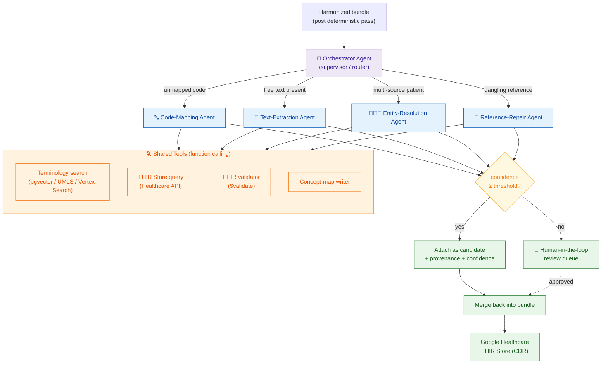
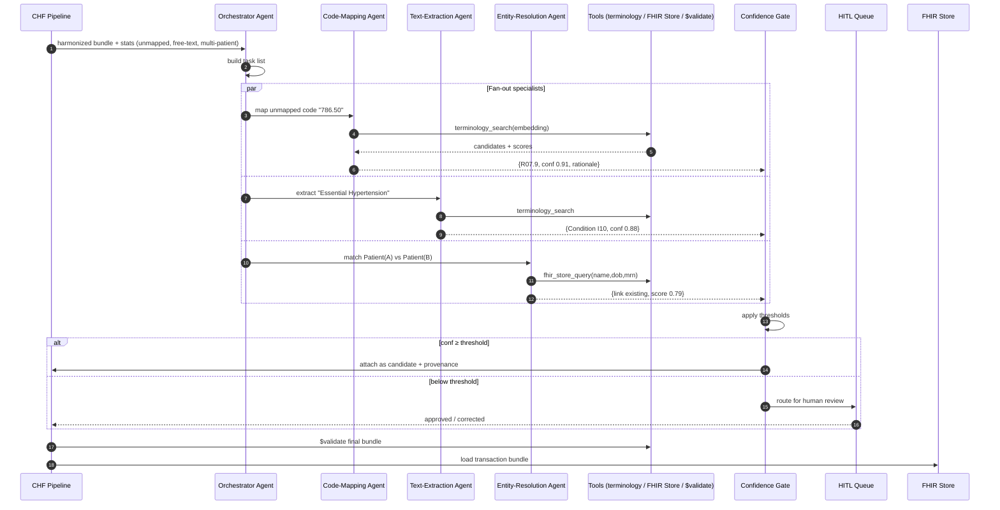

# Agentic AI for the Clinical Harmonization Framework (CHF)

**Author:** Mukesh Kumar — Data / Solution Architect
**Project:** AI-augmented FHIR harmonization for healthcare interoperability
**Target platform:** Google Cloud (Healthcare API FHIR Store, Vertex AI, Dataproc/Databricks, Pub/Sub, GCS, BigQuery)

> **One-line pitch (for the interview):** *"I took an existing, deterministic FHIR
> harmonization pipeline that loads a Google Healthcare FHIR Store, and designed an
> agentic-AI layer that parses unstructured clinical content, maps the long tail of codes,
> resolves patients across sources, and repairs broken references — all confidence-gated,
> provenance-tagged, and human-in-the-loop for anything below threshold."*

---

## 1. Executive Summary

The Clinical Harmonization Framework (CHF) ingests **FHIR R4 bundles from multiple provider
sources**, harmonizes clinical codes, separates resources, and loads a **Google Cloud Healthcare
FHIR Store (CDR)** consumed downstream for interoperability (US Core / USCDI).

The current pipeline is **fully deterministic** — it works well for clean, coded data but hits
a wall on the messy reality of multi-source healthcare data:

- Code mapping is a handful of hardcoded lookups; the **long tail is passed through unmapped**.
- **No NLP** — free-text diagnoses, dosage instructions, and clinical documents are never parsed.
- **No patient matching** — the same patient from two sources is treated as two, and duplicates
  are silently dropped.
- **Broken references** are reported but never repaired.

This document proposes an **Agentic AI layer** that slots in as a *fallback* to the deterministic
path (never replacing it), turning CHF from a "pass-through-what-you-can't-map" pipeline into a
system that **actively parses, maps, links, and repairs** — while staying auditable and clinically safe.

---

## 2. Current-State Architecture (deterministic)

```mermaid
flowchart LR
    subgraph SRC["Provider Systems (FHIR R4)"]
        P1["Source A"]
        P2["Source B"]
        P3["Source C"]
    end

    SRC --> ROUTE{"Bundle size?"}
    ROUTE -->|"< 600MB"| PS["Pub/Sub"]
    ROUTE -->|"large"| GCS["GCS link"]
    PS --> SPARK["Spark pipeline<br/>(Dataproc / Databricks)"]
    GCS --> SPARK

    subgraph PIPE["CHF Deterministic Pipeline"]
        direction LR
        V["Pre-Validation"] --> H["Harmonization<br/>(static ICD/SNOMED maps)"]
        H --> T["Transformation<br/>(refs, dedup)"]
        T --> E["Enrichment"]
        E --> SEP["Resource<br/>Separation"]
        SEP --> B["Transaction<br/>Bundle"]
    end

    SPARK --> PIPE
    B --> FHIR["Google Healthcare<br/>FHIR Store (CDR)"]
    B --> BQ["BigQuery<br/>metrics / audit"]

    classDef s fill:#e3f2fd,stroke:#1565c0,color:#0d47a1;
    classDef p fill:#e8f5e9,stroke:#2e7d32,color:#1b5e20;
    classDef o fill:#fff3e0,stroke:#ef6c00,color:#e65100;
    class P1,P2,P3,SRC s;
    class V,H,T,E,SEP,B p;
    class FHIR,BQ o;
```



### Where the deterministic pipeline hits its limits (evidence from the code)

| Gap | Today | Evidence |
|---|---|---|
| **Long-tail code mapping** | ~10 hardcoded ICD9→ICD10, 10+7 SNOMED entries; unmapped codes pass through | `icd_mapper.py:48-59`, `snomed_mapper.py:39-60`, `icd_mapper.py:168-175` |
| **Medication (RxNorm/NDC)** | No-op — reads codings, returns unchanged | `harmonization_engine.py:179-184` |
| **Free text / narrative** | No NLP; `code.text`, dosage text, DocumentReference never read | `sample_bundle.json:145,377` |
| **Patient entity resolution** | Singleton assumed; extra Patients dropped; dedup = exact identifier only | `resource_separator.py:144-148`, `document_merger.py:33-50` |
| **Dangling references** | Reported as WARNING, never repaired | `reference_resolver.py:69-91`, `validator.py:187-234` |
| **Clinical inference** | Severity / interpretation = 2–4 code hardcoded tables | `resource_enricher.py:62-127` |

---

## 3. Target Architecture — Agentic AI Layer

The AI layer is a **new `src/chf/ai/` module** invoked as a **fallback inside existing stages**.
Deterministic mapping runs first (fast, free, auditable); agents fire **only when the deterministic
path fails or emits low confidence**. Everything the agents produce is **provenance-tagged and
confidence-gated**.



---

## 4. Agent Catalog

Each agent is a **narrow, tool-using specialist** with a strict output contract (structured JSON
validated against a schema). None of them free-writes into the FHIR Store — they return
*candidate* elements the pipeline attaches with provenance.

### 4.1 Orchestrator Agent (supervisor)
- **Role:** inspects the post-deterministic bundle, decides which specialist agents to invoke and on which resources. Pure routing — no clinical output.
- **Input:** harmonized bundle + harmonization stats (`unmapped_codes`, warnings).
- **Output:** a task list `[{agent, resource_ref, reason}]`.
- **Pattern:** router / dispatcher; can fan out specialists in parallel per resource.

### 4.2 Code-Mapping Agent
- **Role:** map the long tail of codes the static tables miss (ICD9→ICD10, ICD10→SNOMED, LOINC→SNOMED, **RxNorm/NDC** which is currently unimplemented).
- **Tools:** `terminology_search` (embedding KNN over a terminology index), `fhir_validate`.
- **Output:** `{ target_system, target_code, display, confidence, rationale }`.
- **Slots into:** `HarmonizationEngine` fallback when `mapping_source == "none"` (`icd_mapper.py:168-175`).

### 4.3 Text-Extraction Agent (clinical NLP)
- **Role:** parse unstructured content into structured FHIR — `Condition.code.text` → coded
  `Condition`; `dosageInstruction.text` → structured `Dosage`; `DocumentReference` narrative →
  coded `Condition`/`Observation`.
- **Tools:** `terminology_search`, `fhir_validate`.
- **Output:** candidate coded elements + source span for provenance.
- **Slots into:** a new pre-separation step; reads fields nothing reads today (`sample_bundle.json:145,377`).

### 4.4 Entity-Resolution Agent (patient matching / EMPI-lite)
- **Role:** decide whether Patients from different sources are the **same person**; link to an
  existing FHIR Store Patient or create one — instead of dropping extras.
- **Tools:** `fhir_store_query` (search existing Patients), `terminology_search` (demographic embeddings).
- **Output:** `{ match: link|new|uncertain, target_patient_id, score, matched_on:[name,dob,mrn,address] }`.
- **Slots into:** replaces "first Patient wins, drop the rest" (`resource_separator.py:144-148`).
- **Guardrail:** patient *merge* is **never auto-applied** — only *link* proposals; merges go to HITL.

### 4.5 Reference-Repair Agent
- **Role:** for a dangling reference (e.g. a `Condition` pointing to a Patient absent from the
  bundle), find the target in the FHIR Store or synthesize a minimal placeholder.
- **Tools:** `fhir_store_query`, `fhir_validate`.
- **Output:** `{ resolved_reference | placeholder_resource, confidence }`.
- **Slots into:** upgrades the report-only behavior (`reference_resolver.py:69-91`).

---

## 5. Orchestration & Control Flow



**Design choices worth defending in interview:**
- **Deterministic-first, AI-as-fallback** — cheaper, faster, auditable; AI only touches the long tail.
- **Specialist agents over one mega-prompt** — narrow scope = higher accuracy, easier evals, cheaper models per task.
- **Structured output contracts** — every agent returns schema-validated JSON, so the pipeline
  never parses free-form model text.
- **Confidence gate + HITL** — the safety valve. High-confidence auto-applies; low-confidence is
  reviewed. Mirrors the existing "unmapped is soft, never fails the bundle" philosophy.

---

## 6. Confidence Gating & Provenance

Every AI-produced element carries provenance so downstream consumers (and auditors) can tell
machine-suggested data from source data. CHF already has the hook — `_originalCode` provenance
stubs (`icd_mapper.py:196-208`).

```json
{
  "system": "http://snomed.info/sct",
  "code": "38341003",
  "display": "Hypertensive disorder",
  "extension": [{
    "url": "https://chf/ai-provenance",
    "extension": [
      { "url": "method",     "valueString": "text-extraction-agent" },
      { "url": "model",      "valueString": "vertex-clinical-v1" },
      { "url": "confidence", "valueDecimal": 0.88 },
      { "url": "sourceText", "valueString": "Essential Hypertension" },
      { "url": "reviewed",   "valueBoolean": false }
    ]
  }]
}
```

| Confidence band | Action |
|---|---|
| `≥ 0.90` | Auto-apply, tagged machine-generated |
| `0.70 – 0.90` | Apply as **candidate**, flagged for optional review |
| `< 0.70` | Do **not** apply — route to HITL review queue |
| Patient **merge** (any score) | Always HITL — never auto-merge people |

---

## 7. Worked Example — Free Text → Coded FHIR

**Input** (`Condition` from Source A, coded only as free text — `sample_bundle.json:145`):
```json
{ "resourceType": "Condition",
  "code": { "text": "Essential Hypertension" },
  "subject": { "reference": "urn:uuid:patient-A" } }
```

**Step 1 — Deterministic pass.** `icd_mapper` iterates `code.coding` only; there are no codings,
so nothing maps. Bundle would previously load an **uncoded** Condition.

**Step 2 — Orchestrator** sees `code.text` present, no coding → dispatches the **Text-Extraction Agent**.

**Step 3 — Agent + tool.** Embeds `"Essential Hypertension"`, calls `terminology_search`:

| candidate | system | code | score |
|---|---|---|---|
| **Essential (primary) hypertension** | ICD-10 | **I10** | **0.92** |
| Hypertensive disorder | SNOMED | 38341003 | 0.88 |
| Secondary hypertension | ICD-10 | I15.9 | 0.55 |

**Step 4 — Gate.** `0.92 ≥ 0.90` → auto-apply.

**Step 5 — Output.** The Condition now carries coded `I10` + SNOMED `38341003`, each with the
AI-provenance extension from §6.

**Step 6 — Validate & load.** `$validate` against US Core, then loaded to the FHIR Store — now
queryable by code instead of only free text.

> A borderline case like `"HTN, poorly ctrl"` scoring 0.74 would be **applied as a candidate and
> flagged**; something ambiguous at 0.60 goes to the **review queue** rather than guessing.

---

## 8. Worked Example — Patient Resolution Across Sources

Two bundles reference the same person with slightly different data:

| | Source A | Source B |
|---|---|---|
| Name | `Jon Smith` | `Jonathan Smith` |
| DOB | `1948-02-11` | `1948-02-11` |
| MRN | `A-88231` | *(none)* |
| Address ZIP | `83702` | `83702` |

**Today:** `resource_separator` keeps the first Patient and **drops the second**
(`resource_separator.py:144-148`) — B's encounters end up orphaned.

**With the Entity-Resolution Agent:** embeds demographics, queries the FHIR Store, returns
`{ match: "link", score: 0.86, matched_on: ["dob","address","name-fuzzy"] }`. Above the link
threshold → B's resources are re-pointed to A's Patient. If it were `0.62` → HITL, and a **merge**
would *always* be HITL (you never auto-merge two people).

---

## 9. Guardrails, Security & Compliance

- **PHI stays in-boundary.** All model calls use **Vertex AI within the same GCP project**; no PHI
  leaves the tenancy. Respects `security.phi_fields_to_mask` in `config/settings.yaml`.
- **No autonomous writes.** Agents return *candidates*; only the deterministic pipeline writes to
  the FHIR Store, after `$validate`. Agents cannot call the load path directly.
- **Full auditability.** Every AI decision (model, prompt version, confidence, source span) is
  logged to BigQuery alongside the existing `processing_audit` / `pipeline_metrics` tables.
- **Human-in-the-loop** for low confidence and all patient merges.
- **Deterministic fallback preserved.** If the AI layer is disabled or errors, CHF degrades exactly
  to today's behavior — no regression.
- **Prompt-injection defense.** Clinical text is treated as data, never instructions; agents run
  with least-privilege tools and schema-locked outputs.

---

## 10. Technology Stack

| Concern | Choice | Rationale |
|---|---|---|
| Agent runtime | **Vertex AI Agent Builder / ADK** (or LangGraph) | Managed, GCP-native, tool-calling + state |
| LLM | **Gemini on Vertex AI** (clinical-tuned prompts) | In-project, HIPAA-eligible, function calling |
| Embeddings + retrieval | **Vertex AI embeddings + pgvector / Vertex AI Search** | Terminology KNN for code/name matching |
| FHIR store & validation | **Google Cloud Healthcare API** (`$validate`, search) | The CDR + native profile validation |
| Compute | **Dataproc / Databricks (PySpark)** | Existing CHF runtime — agents invoked per-resource |
| Messaging / storage | **Pub/Sub, GCS** | Existing ingestion |
| Analytics / audit | **BigQuery** | Existing metrics + new AI-decision log |
| IaC | **Terraform** | Existing `infrastructure/terraform` |

---

## 11. Evaluation Strategy

- **Golden set:** curated bundles with known-correct codes / patient links; measure precision,
  recall, and mapping accuracy per agent.
- **Confidence calibration:** verify that stated confidence tracks actual correctness (reliability
  curve) so thresholds are trustworthy.
- **Human-review sampling:** audit a % of auto-applied high-confidence decisions to catch drift.
- **Regression gate:** the deterministic path must stay byte-identical when AI is off.
- **Safety metric:** zero tolerance for silent wrong-patient links — track false-link rate as the
  primary safety KPI.

---

## 12. Phased Roadmap

```mermaid
flowchart LR
    subgraph PH1["Phase 1 — Foundations"]
        A["Terminology index<br/>(embeddings)"]
        B["AI-provenance schema<br/>+ confidence gate"]
        C["BigQuery decision log"]
    end
    subgraph PH2["Phase 2 — First agents"]
        D["Code-Mapping Agent<br/>(long-tail + RxNorm)"]
        E["Text-Extraction Agent"]
    end
    subgraph PH3["Phase 3 — Linkage"]
        F["Entity-Resolution Agent<br/>+ HITL console"]
        G["Reference-Repair Agent"]
    end
    subgraph PH4["Phase 4 — Scale & govern"]
        H["Eval harness<br/>+ calibration"]
        I["Autonomy tuning<br/>per-agent thresholds"]
    end
    PH1 --> PH2 --> PH3 --> PH4

    classDef p fill:#e8f5e9,stroke:#2e7d32,color:#1b5e20;
    class A,B,C,D,E,F,G,H,I p;
```



---

## 13. Interview Talking Points (Q&A)

**Q. Why agents instead of one big LLM call?**
Narrow specialists are more accurate, cheaper (right-sized model per task), independently
testable, and safer — a code-mapping error and a patient-match error have very different blast
radii and deserve different thresholds.

**Q. How do you keep it clinically safe?**
Deterministic-first; AI only fills gaps; every output is confidence-gated, provenance-tagged, and
validated with FHIR `$validate`; low confidence and all patient merges go to humans; nothing is
autonomously written to the CDR.

**Q. What's the hardest part?**
Patient entity resolution — a wrong link is a patient-safety event. I treat link vs. merge
differently, keep merges human-gated, and make false-link rate the top KPI.

**Q. How does this fit the existing system?**
It's additive — a `src/chf/ai/` fallback module invoked inside current stages. Turn it off and CHF
behaves exactly as today, so adoption carries no regression risk.

**Q. Why Google Healthcare API + Vertex AI?**
The CDR is already a Google FHIR Store; keeping models in-project means PHI never leaves the
tenancy, and `$validate` / search are native tools the agents can call.

---

*This document is a design artifact for interview presentation. Code references
(`file:line`) point to the current CHF implementation to show the AI layer is grounded in the
real system, not hypothetical.*
