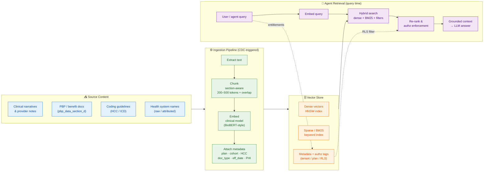
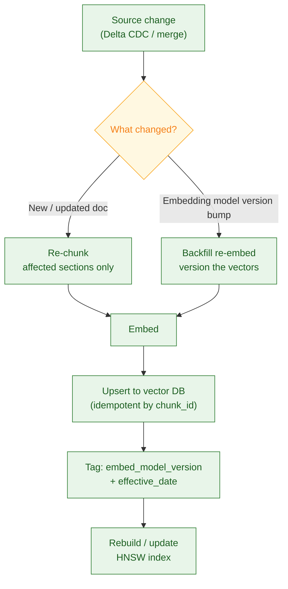
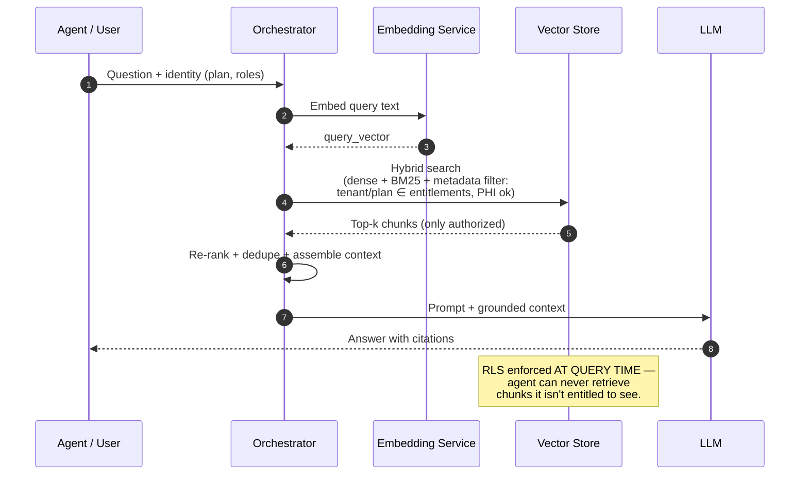
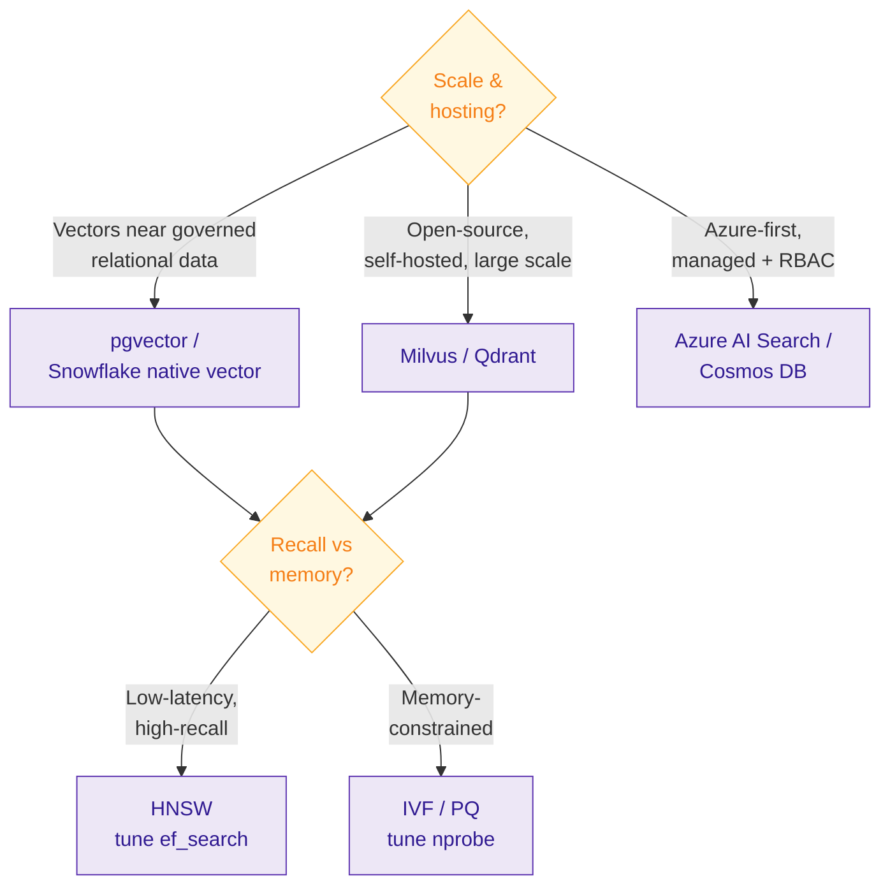

# PopA — Vector Layer Design for Agent Retrieval (RAG) over Clinical Data

**Author:** Mukesh Kumar (Data Architect)
**Context:** Semantic retrieval layer for AI agents over PopA's unstructured / semi-structured
content — clinical narratives, provider notes, PBP benefit documents, and HCC coding guidelines.
Tied to reference tables in `ma_dashboard_ref_tables.sql`
(`REF_HEALTH_SYSTEM_NAMES_MAPPINGS`, `HEALTH_SYSTEM_NORMALIZED_NAMES`).

> Engine-agnostic design. Reference implementations shown for **pgvector** (vectors co-located
> with governed relational data) and pluggable to **Milvus / Qdrant / Azure AI Search / Cosmos**.

---

## 1. End-to-End Architecture (Ingestion → Vector Store → Agent Retrieval)



---

## 2. Ingestion Detail — Freshness & Re-embedding



---

## 3. Query-Time Hybrid Search with Row-Level Security



---

## 4. Health-System Name Normalization (concrete pgvector use case)

Maps the messy `ATTRIBUTED_HEALTH_SYSTEM_RAW` → canonical `SUGGESTED_NAME` via cosine similarity,
populating `SIMILARITY_SCORE` in `HEALTH_SYSTEM_NORMALIZED_NAMES`.

```mermaid
flowchart LR
    RAW["Raw name<br/>'St Lukes Hosp - Boise'"] --> EM["Embed → vector"]
    EM --> KNN["pgvector KNN<br/>ORDER BY embedding <=> query<br/>LIMIT 1"]
    subgraph REF["Canonical dictionary<br/>(REF_HEALTH_SYSTEM_NAMES_MAPPINGS)"]
        C1["'St. Luke's Health System'"]
        C2["'Saint Alphonsus'"]
        C3["'Primary Health Medical Group'"]
    end
    KNN --> REF
    REF --> OUT["SUGGESTED_NAME +<br/>SIMILARITY_SCORE<br/>(1 - cosine distance)"]
    OUT --> GATE{"score ≥ threshold?"}
    GATE -->|yes| ACC["Auto-normalize"]
    GATE -->|no| REV["Flag for human review"]

    classDef a fill:#e3f2fd,stroke:#1565c0,color:#0d47a1;
    classDef b fill:#fff3e0,stroke:#ef6c00,color:#e65100;
    classDef c fill:#e8f5e9,stroke:#2e7d32,color:#1b5e20;
    class RAW,EM,KNN a;
    class C1,C2,C3,REF b;
    class OUT,GATE,ACC,REV c;
```



---

## 5. Index & Engine Selection (decision guide)



---

## Design Notes (talking points)

| Decision | Choice | Why |
|---|---|---|
| **Chunking** | Section-aware, 200–500 tokens + overlap | Preserves clinical/PBP section boundaries; overlap avoids context loss at edges |
| **Embedding** | Domain model (clinical/BioBERT-style) | Better semantics on medical terminology than general models |
| **Index** | HNSW default; IVF/PQ at memory limits | HNSW gives best recall-latency; PQ compresses at large scale |
| **Retrieval** | Hybrid (dense + BM25 + metadata) | Exact codes (ICD/HCC) matter alongside semantics in healthcare |
| **Security** | Metadata authz tags → RLS at query time | Agent only ever retrieves entitled chunks (tenant/plan/PHI) |
| **Freshness** | Re-embed on CDC; version on model change | Keeps vectors in sync with governed source-of-truth |

---

## 6. Worked Example — End-to-End Walkthrough

Two concrete records traced through every stage: first the name-normalization flow
(the pgvector use case), then a full agent-retrieval query — with actual values, SQL, and numbers.

### Example A — Health-System Name Normalization

**Goal:** a claim arrives with a messy provider org name; we normalize it to a canonical
health system and record the confidence.

**Step 1 — Raw input arrives.** A claim row lands in `PCP_ATT` with:
```
ATTRIBUTED_HEALTH_SYSTEM_RAW = "St Lukes Hosp - Boise ID"
STATE = "ID"
```
This is dirty: abbreviations, no apostrophe, city suffix. Exact string match against the
canonical dictionary **fails**.

**Step 2 — Build the canonical dictionary (one-time / on change).**
`REF_HEALTH_SYSTEM_NAMES_MAPPINGS` holds the clean names. We embed each once and store the vector.
```sql
CREATE EXTENSION IF NOT EXISTS vector;

CREATE TABLE health_system_dict (
    id            BIGSERIAL PRIMARY KEY,
    state         TEXT,
    canonical     TEXT,
    embedding     VECTOR(384)          -- e.g. sentence-transformer dim
);

-- populated by an embedding job:
-- "St. Luke's Health System"          -> [0.021, -0.118, ...]
-- "Saint Alphonsus Health System"     -> [-0.044, 0.093, ...]
-- "Primary Health Medical Group"      -> [0.101, 0.017, ...]

CREATE INDEX ON health_system_dict
    USING hnsw (embedding vector_cosine_ops);
```

**Step 3 — Embed the raw name.** The raw string → embedding model → a 384-dim vector:
```
"St Lukes Hosp - Boise ID"  ->  q = [0.019, -0.121, 0.055, ...]
```

**Step 4 — KNN similarity search (pgvector).** `<=>` is cosine **distance**;
similarity = `1 - distance`.
```sql
SELECT
    canonical,
    1 - (embedding <=> :q) AS similarity_score
FROM health_system_dict
WHERE state = 'ID'                    -- metadata pre-filter
ORDER BY embedding <=> :q             -- nearest first
LIMIT 3;
```
Result:

| canonical | similarity_score |
|---|---|
| **St. Luke's Health System** | **0.94** |
| Saint Alphonsus Health System | 0.61 |
| Primary Health Medical Group | 0.48 |

**Step 5 — Threshold gate.** Rule: `score >= 0.85` → auto-accept; else flag for human review.
`0.94 >= 0.85` → **auto-normalize**.

**Step 6 — Write the result.** Insert into `HEALTH_SYSTEM_NORMALIZED_NAMES`:
```
STATE                        = "ID"
ATTRIBUTED_HEALTH_SYSTEM_RAW = "St Lukes Hosp - Boise ID"
ATTRIBUTED_HEALTH_SYSTEM     = "St. Luke's Health System"   -- the match
SUGGESTED_NAME               = "St. Luke's Health System"
SIMILARITY_SCORE             = 0.94
CREATED_BY                   = "vector_normalizer"
```
Downstream, `MEMBER_LEVEL.ATT_BILLING_HEALTH_SYSTEM` now rolls up cleanly instead of splitting
"St Lukes Hosp" and "St. Luke's" into two systems.

> A row like `"St Luks"` scoring 0.71 would fall below 0.85 → routed to a review queue
> instead of guessing.

### Example B — Agent Retrieval (RAG) over Clinical/PBP Content

**Goal:** an analyst-agent answers a benefits question, grounded only in documents the user
is entitled to see.

**Step 1 — Ingestion (already done, CDC-triggered).** A PBP benefit PDF for plan **H1234-001**
was processed:
- Extracted text → chunked section-aware (~300 tokens, 15% overlap)
- One chunk: *"Part D optional supplemental premium is $18.50/month; MOOP $4,900..."*
- Embedded → stored with metadata:
```json
{
  "chunk_id": "H1234-001_secD_007",
  "plan": "H1234-001",
  "doc_type": "PBP",
  "hcc": null,
  "effective_date": "2025-01-01",
  "phi": false,
  "embed_model_version": "clinical-v2",
  "authz_tags": ["tenant:BCBSID", "plan:H1234-001"]
}
```

**Step 2 — User asks a question.** User = analyst entitled to `tenant:BCBSID`, plans
`H1234-001` and `H1234-002` only.
> *"What's the optional supplemental Part D premium for the H1234-001 plan in 2025?"*

**Step 3 — Embed the query.** Query text → `query_vector` (same model, `clinical-v2`).

**Step 4 — Hybrid search with metadata + RLS filter.** Combine dense vector + BM25 keyword
("Part D", "premium") + **hard authz filter**:
```sql
-- conceptual hybrid query
SELECT chunk_id, text, 1 - (embedding <=> :qv) AS dense_score
FROM doc_chunks
WHERE authz_tags && ARRAY['plan:H1234-001','plan:H1234-002']   -- RLS: only entitled
  AND doc_type = 'PBP'
  AND effective_date <= '2025-12-31'
ORDER BY embedding <=> :qv
LIMIT 20;
-- then fuse with BM25 keyword scores, re-rank to top-k
```
Because the filter runs **at query time**, a chunk tagged `plan:H9999-001` (a plan the user
can't see) is never returned — even if it's semantically closer.

**Step 5 — Re-rank & assemble context.** Top result after fusion:

| chunk_id | dense | bm25 | fused |
|---|---|---|---|
| H1234-001_secD_007 | 0.91 | 0.88 | **0.90** |
| H1234-001_secC_003 | 0.62 | 0.40 | 0.53 |

Top-k chunks are deduped and packed into the prompt.

**Step 6 — Grounded LLM answer.**
```
Prompt = system + user question + [chunk H1234-001_secD_007 text]
```
Answer returned with citation:
> *"For plan H1234-001 (2025), the optional supplemental Part D premium is **$18.50/month**.
> [source: PBP §D, H1234-001_secD_007]"*

**Step 7 — Freshness loop.** When the 2026 PBP file lands (CDC detects change) → that section
is re-chunked, re-embedded, upserted idempotently by `chunk_id`, and tagged
`effective_date=2026-01-01`. Old and new coexist; the query's `effective_date` filter picks
the right one.

### What this demonstrates

- **Semantic matching** (Example A) — vectors solve the fuzzy-name problem exact SQL can't.
- **Governed RAG** (Example B) — hybrid search + metadata RLS so an agent retrieves only
  entitled, fresh, grounded context.
```
